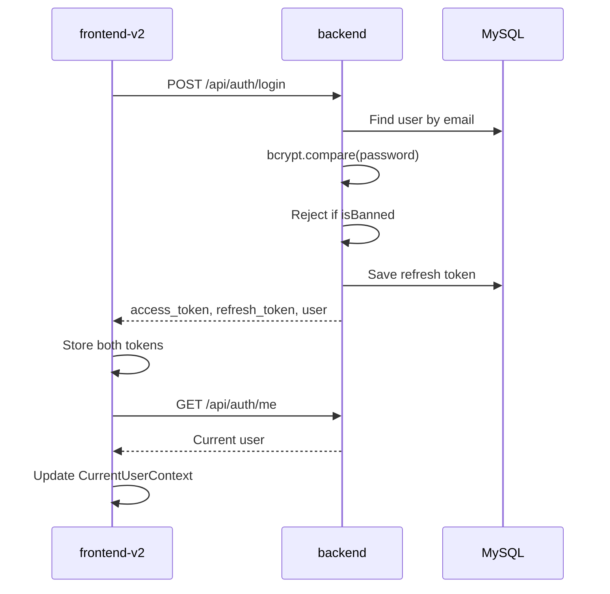
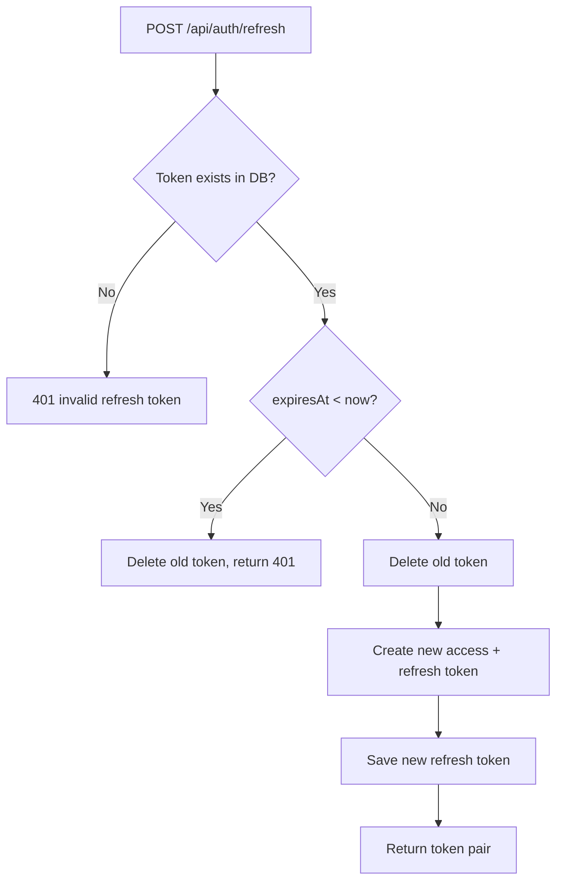
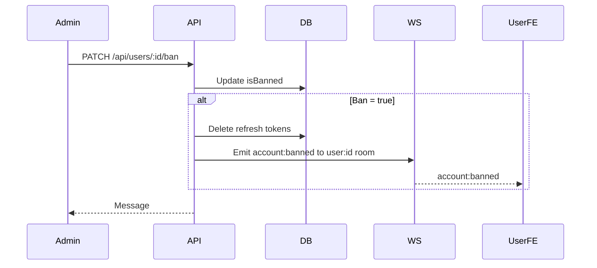

# Auth And Users Flow

This document tracks the current auth and user-management behavior implemented in `backend/src/auth`, `backend/src/users`, and the matching auth context in `frontend-v2`.

## Current Status

| Feature | Status |
|---|---|
| Register | Implemented |
| Login | Implemented |
| Refresh token rotation | Implemented |
| Logout one refresh token | Implemented |
| Current user `/auth/me` | Implemented |
| Change password | Implemented |
| Admin list users | Implemented |
| Admin update role | Implemented |
| Admin ban/unban | Implemented |
| Block banned access tokens | Implemented |
| Frontend current-user sync after login | Implemented |
| Logout-all endpoint | Not implemented |
| Delete user endpoint | Not implemented |

## Backend Endpoints

| Method | Path | Auth | Purpose |
|---|---|---|---|
| `POST` | `/api/auth/register` | Public | Create account |
| `POST` | `/api/auth/login` | Public, throttled | Authenticate and return token pair |
| `GET` | `/api/auth/me` | JWT | Return current user |
| `POST` | `/api/auth/refresh` | Public body token | Rotate refresh token |
| `PATCH` | `/api/auth/password` | JWT | Change password |
| `POST` | `/api/auth/logout` | JWT | Delete one refresh token |
| `GET` | `/api/users` | ADMIN | List users with filters |
| `PATCH` | `/api/users/:id/role` | ADMIN | Change role |
| `GET` | `/api/users/:id/profile` | JWT | User profile summary |
| `PATCH` | `/api/users/:id/ban` | ADMIN | Ban or unban account |

## Login Flow

Frontend files involved:

- `frontend-v2/src/pages/LoginPage.tsx`
- `frontend-v2/src/hooks/CurrentUserProvider.tsx`
- `frontend-v2/src/hooks/currentUserContext.ts`
- `frontend-v2/src/hooks/useCurrentUser.tsx`
- `frontend-v2/src/services/auth.api.ts`

## Current User Bootstrap

On app load, `CurrentUserProvider` calls `/api/auth/me`.

| Result | Frontend behavior |
|---|---|
| `200` | Store user in memory |
| `401` or `403` | Clear local tokens and set user to null |
| Network error or server error | Set user to null, but do not clear tokens unless the error is an auth status |

This keeps temporary backend/network failures from unnecessarily logging out the user.

## JWT Validation

Protected backend routes use `JwtStrategy`.

Current behavior:

1. Decode and validate JWT signature/expiry.
2. Look up the user in DB by `payload.sub`.
3. Reject missing users.
4. Reject `isBanned = true`.
5. Return a clean `req.user` object with only `id`, `email`, `role`, and `reputationScore`.

This means a user banned after login cannot continue using an old access token until it expires.

## Refresh Token Flow

Notes:

- Refresh token rotation is implemented.
- The stored `expiresAt` is currently calculated with a fixed 7-day period in service code.
- The service limits each user to 3 stored refresh tokens by deleting the oldest token before saving a new one.

## Logout Flow

Frontend:

1. Read refresh token from local storage.
2. Call `POST /api/auth/logout` if a refresh token exists.
3. Remove stored tokens locally.
4. Clear `CurrentUserContext`.
5. Navigate to `/login`.

Backend:

1. Require JWT.
2. Find refresh token in DB.
3. Delete that token.
4. Return success.

## Ban/Unban Flow

Expected client behavior after ban:

- Online user receives the banned modal.
- Refresh tokens are removed from DB.
- Existing access token is rejected on the next protected API call because JWT validation checks `isBanned`.

## User Test Checklist

| ID | Case | Expected |
|---|---|---|
| AUTH-01 | Login active user | Tokens saved, `/auth/me` loads user, protected route opens |
| AUTH-02 | Login wrong password | Error shown, no tokens saved |
| AUTH-03 | Login banned user | `403`, no tokens saved |
| AUTH-04 | Refresh with valid refresh token | Old refresh token deleted, new pair returned |
| AUTH-05 | Refresh with invalid token | `401` |
| AUTH-06 | Logout | DB refresh token deleted, local tokens and context cleared |
| AUTH-07 | Ban logged-in user | Next protected call returns `401`/`403` |
| AUTH-08 | `/auth/me` returns `401`/`403` | Frontend clears tokens |
| USER-01 | Admin list users | Returns paginated rows and stats |
| USER-02 | Non-admin list users | `403` |
| USER-03 | Admin update role | Role changed |
| USER-04 | Admin ban/unban | `isBanned` changed and tokens removed when banned |

## Current Verification

| Check | Result |
|---|---|
| Backend TypeScript | Pass |
| Frontend TypeScript | Pass |
| Backend unit tests | Pass |
| Backend build | Pass |
| Frontend build | Pass |
| Targeted user/auth lint | Pass |
| Live API test | Blocked by MySQL connection in the current environment |

