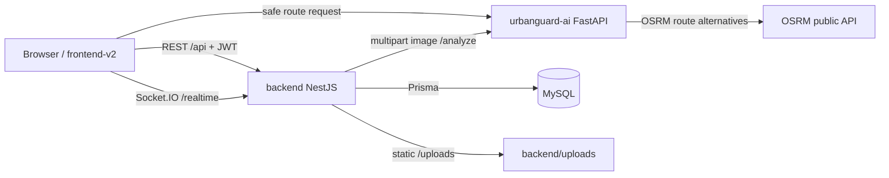

# UrbanGuard

UrbanGuard is an urban traffic incident reporting and safety-routing system. Users submit road incidents with an image, GPS position, and description. The backend stores the report, asks the AI service to review the image, and exposes validated incidents to the map UI. Admin users can manage accounts and review pending reports.

This repository is a multi-app workspace. It is not configured as a root npm workspace; install and run each app from its own folder.

## Current Apps

| Path | Role | Stack |
|---|---|---|
| `backend/` | Main REST API, auth, reports, users, notifications, statistics | NestJS, Prisma, MySQL, Socket.IO |
| `frontend-v2/` | Main web app | Vite, React, TypeScript, Tailwind, Leaflet |
| `urbanguard-ai/` | AI image analysis and safe-route service | FastAPI, Python, OSRM helpers |
| `forum-backend/`, `forum-frontend/` | Separate forum apps | Out of scope for the current backend/frontend-v2 review |
| `docs/` | Project documentation | Markdown |

## High-Level Architecture



## Backend API Snapshot

All backend routes use the `/api` prefix.

| Area | Endpoint | Status |
|---|---|---|
| Health | `GET /api/health` | Implemented |
| Auth | `POST /api/auth/register` | Implemented |
| Auth | `POST /api/auth/login` | Implemented |
| Auth | `GET /api/auth/me` | Implemented, JWT required |
| Auth | `POST /api/auth/refresh` | Implemented |
| Auth | `PATCH /api/auth/password` | Implemented, JWT required |
| Auth | `POST /api/auth/logout` | Implemented, JWT required |
| Users | `GET /api/users` | Implemented, ADMIN required |
| Users | `PATCH /api/users/:id/role` | Implemented, ADMIN required |
| Users | `GET /api/users/:id/profile` | Implemented, JWT required |
| Users | `PATCH /api/users/:id/ban` | Implemented, ADMIN required |
| Reports | `GET /api/reports/active` | Implemented |
| Reports | `POST /api/reports` | Implemented, JWT + image upload required |
| Reports | `POST /api/reports/:id/vote` | Implemented, JWT required |
| Admin | `GET /api/admin/reports/pending` | Implemented, ADMIN required |
| Notifications | `GET /api/notifications` | Implemented, JWT required |
| Notifications | `GET /api/notifications/unread-count` | Implemented, JWT required |
| Notifications | `PATCH /api/notifications/read-all` | Implemented, JWT required |
| Notifications | `PATCH /api/notifications/:id/read` | Implemented, JWT required |
| Notifications | `DELETE /api/notifications` | Implemented, JWT required |
| Statistics | `GET /api/statistics/overview` | Implemented |
| Statistics | `GET /api/statistics/heatmap-data` | Implemented |

Known gaps:

- `GET /api/reports`, `GET /api/reports/:id`, `PATCH /api/reports/:id/status`, and `DELETE /api/reports/:id` are expected by parts of `frontend-v2`, but are not currently exposed by `ReportsController`.
- Vote response shape is not yet aligned with the frontend expectation in all places.
- Some realtime hooks exist, but report create/status flows do not fully emit all frontend-expected events.

## Requirements

- Node.js 20+ recommended
- npm
- MySQL reachable by `backend/.env`
- Python 3.10+ for `urbanguard-ai`

## Setup

### 1. Database

```sql
CREATE DATABASE urbanguard CHARACTER SET utf8mb4 COLLATE utf8mb4_unicode_ci;
```

### 2. Backend

```bash
cd backend
npm install
npx prisma generate
npx prisma migrate dev
npm run start:dev
```

Expected backend URLs:

- API: `http://localhost:3000/api`
- Swagger: `http://localhost:3000/api/docs`
- Uploads: `http://localhost:3000/uploads/...`

Important backend environment variables:

| Variable | Purpose |
|---|---|
| `DATABASE_URL` | Prisma MySQL connection |
| `JWT_SECRET` | Access token signing secret |
| `JWT_EXPIRES_IN` | Access token lifetime |
| `JWT_REFRESH_SECRET` | Refresh token signing secret |
| `JWT_REFRESH_EXPIRES_IN` | Refresh token lifetime |
| `AI_SERVICE_URL` | AI service base URL, default code fallback is `http://127.0.0.1:5000` |
| `PORT` | Backend port, default `3000` |
| `CORS_ORIGIN` | Optional Socket.IO CORS origin list |

### 3. AI Service

```bash
cd urbanguard-ai
py -3 -m pip install -r requirements.txt
py -3 -m uvicorn main:app --reload --host 127.0.0.1 --port 5000
```

AI endpoints:

| Endpoint | Purpose |
|---|---|
| `POST /analyze` | Multipart image analysis |
| `POST /safe-route` | String-based route helper |
| `POST /real-safe-route` | Safe route from coordinates and danger points |
| `GET /docs` | FastAPI OpenAPI UI |

### 4. Frontend v2

```bash
cd frontend-v2
npm install
npm run dev
```

Default Vite URL: `http://localhost:3002`

Set `frontend-v2/.env` if needed:

```env
VITE_API_URL=http://localhost:3000
```

## Test And Quality Commands

Backend:

```bash
cd backend
npm test
npx tsc --noEmit
npm run build
```

Frontend:

```bash
cd frontend-v2
npx tsc --noEmit -p tsconfig.app.json
npm run build
npm run lint
```

Current note: targeted user/auth lint passes after the auth-context cleanup. Full frontend lint still reports existing issues in other map/dashboard/notification/report-management files.

## Main User Flows

### Login/session

1. User logs in via `POST /api/auth/login`.
2. Frontend stores `access_token` and `refresh_token`.
3. Frontend calls `/api/auth/me` through the current-user provider before entering protected routes.
4. If `/auth/me` returns `401` or `403`, frontend clears stored tokens.
5. Backend JWT validation checks the user in DB and rejects banned accounts before token expiry.

### Create report

1. User submits a multipart form to `POST /api/reports`.
2. Backend stores the image in `backend/uploads/reports`.
3. Backend calls `AI_SERVICE_URL/analyze`.
4. If AI says the report is relevant, backend stores it as `VALIDATED`; otherwise it remains `PENDING`.
5. `GET /api/reports/active` returns visible validated reports for the map.

### Admin user management

1. Admin calls `GET /api/users` with filters and pagination.
2. Admin can update role with `PATCH /api/users/:id/role`.
3. Admin can ban/unban with `PATCH /api/users/:id/ban`.
4. When a user is banned, refresh tokens are removed and a Socket.IO `account:banned` event is emitted to that user's room.

## Documentation Map

| File | Purpose |
|---|---|
| `SYSTEM_ARCHITECTURE.md` | Root architecture snapshot |
| `AUTH_USERS_FLOW.md` | Auth and user-management flow |
| `READ-RUN.md` | Minimal local run guide |
| `docs/README.md` | Documentation index |
| `docs/01-system-design/system-architecture.md` | System design copy of the architecture snapshot |
| `docs/01-system-design/api-design.md` | API contract snapshot |
| `frontend-v2/README.md` | Frontend-specific guide |

