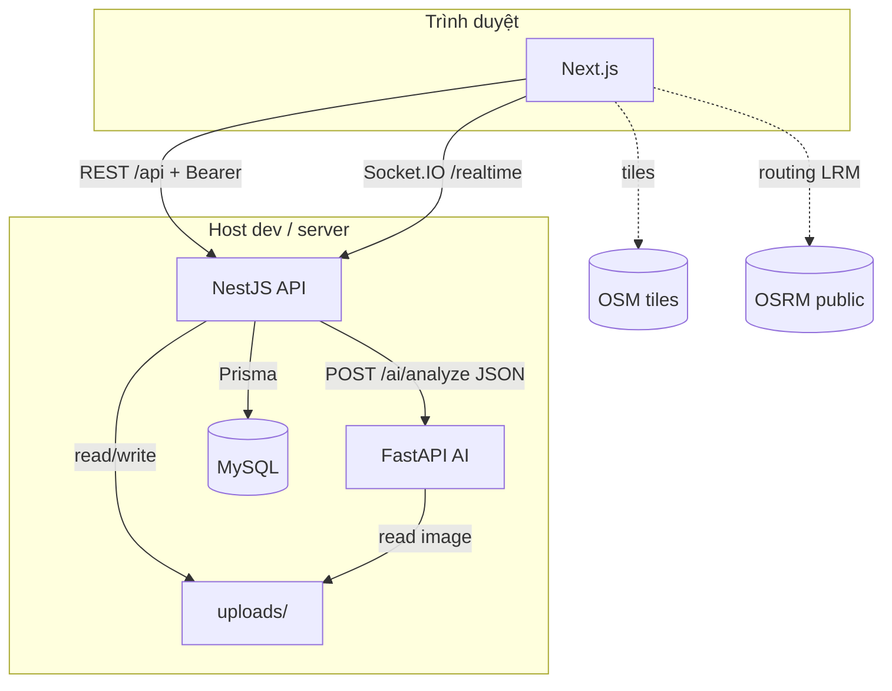

# SYSTEM_ARCHITECTURE — UrbanGuard

Tài liệu **kiến trúc hệ thống tổng hợp** (đồng bộ với code trong repo tại thời điểm biên soạn). Dùng làm bản tham chiếu nhanh khi demo, onboard hoặc mở rộng. Chi tiết C4, API và DB sâu hơn: [`docs/01-system-design/`](./docs/01-system-design/).

---

## 1. Tầm nhìn & ranh giới

| Mục tiêu | Cách đạt |
|----------|----------|
| Tách UI, API nghiệp vụ, AI | Next.js · NestJS · FastAPI (YOLO) chạy **process riêng** |
| Dữ liệu quan hệ thống nhất | **MySQL** + **Prisma** |
| Bản đồ công khai tin cậy | Chỉ **`Report.status = VALIDATED`** lên map công khai (`GET /api/reports/active`) |
| Cập nhật gần realtime | **Socket.IO** namespace `/realtime`, sự kiện **`report:new`** |
| Ảnh báo cáo | Filesystem **`backend/uploads/`**, URL **`/uploads/...`** qua Nest static |
| Tiles & routing bản đồ | **OSM** (CDN) + **OSRM công khai** — **chỉ trên trình duyệt**, không qua Nest |

---

## 2. Cấu trúc repository (monorepo)

Không dùng npm workspace ở root — **cài đặt và chạy riêng** từng thư mục.

| Thư mục | Stack | Vai trò |
|--------|-------|---------|
| **`backend/`** | NestJS 10, Prisma, Passport JWT, Multer, Socket.IO, `@nestjs/axios` | REST `/api/*`, upload, điều phối AI, emit realtime |
| **`frontend/`** | Next.js (App Router), React, Tailwind, react-leaflet, LRM, socket.io-client | `/`, `/map`, marker, OSRM client, banner né đường |
| **`ai-service/`** | FastAPI, Ultralytics YOLOv8n | `POST /ai/analyze` — đọc ảnh theo tên file trong `uploads` |
| **`docs/`** | Markdown | Thiết kế: kiến trúc, API, DB, sequence |

File bổ trợ sản phẩm: `UrbanGuard.md`, `README.md` (cài đặt & cổng dev).

---

## 3. Tiến trình & cổng mặc định (development)

| Process | Cổng (mặc định) | Lệnh gợi ý |
|---------|-----------------|------------|
| MySQL | 3306 | XAMPP / instance local |
| Nest API | 3000 | `cd backend && npm run start:dev` |
| FastAPI AI | 8000 | `cd ai-service && uvicorn main:app --reload --port 8000` |
| Next.js | **3001** (tránh trùng API) | `cd frontend && npx next dev --turbopack -p 3001` |

**Biến môi trường chính**

| Biến | Nơi đặt | Ý nghĩa |
|------|---------|---------|
| `DATABASE_URL` | `backend/.env` | Prisma → MySQL |
| `JWT_SECRET`, `JWT_EXPIRES_IN` | `backend/.env` | JWT |
| `AI_SERVICE_URL` | `backend/.env` | Gốc Python, **không** `/` cuối (vd. `http://127.0.0.1:8000`) |
| `PORT` | `backend/.env` | Cổng Nest (mặc định 3000) |
| `UPLOADS_ROOT` | `ai-service` (tùy chọn) | Đường dẫn tuyệt đối tới `backend/uploads` nếu layout khác mặc định |
| `NEXT_PUBLIC_API_URL` | `frontend/.env.local` | Gốc backend (vd. `http://localhost:3000`) |
| `NEXT_PUBLIC_DEV_REPORT_IMAGE_TOOLS` | `frontend/.env.local` (tùy chọn) | Bật panel dev ảnh test trên `/map` |

---

## 4. Sơ đồ triển khai logic



---

## 5. Module NestJS (đăng ký trong `AppModule`)

| Module | Chức năng thực tế |
|--------|-------------------|
| **PrismaModule** | Global — truy cập DB |
| **AuthModule** | Register / login JWT, `JwtAuthGuard` |
| **UsersModule** | Người dùng |
| **ReportsModule** | `GET /reports/active`, `POST /reports` (multipart), `PATCH /reports/:id/status` (admin); import **AiModule**, **NotificationsModule** |
| **AiModule** | `AiService` — `HttpService` → Python `POST {AI_SERVICE_URL}/ai/analyze` body `{ image_path }` |
| **NotificationsModule** | `NotificationsGateway` — namespace **`/realtime`**, emit **`report:new`** / `report:update` |
| **UploadsModule** | Khung upload (ảnh chính qua Multer trong Reports) |
| **MapModule**, **AdminModule**, **StatisticsModule** | Khung / mở rộng |
| **AiReviewModule** | Stub / tương thích — luồng AI chính: **AiModule** + Python |

Global: prefix **`api`**, static **`/uploads/`**, CORS, Swagger tại **`/api/docs`**.

---

## 6. Luồng nghiệp vụ báo cáo (ReportsService — đồng bộ code)

1. **Upload (HTTP):** Multer lưu file vào `uploads/`, tạo `Report` **`PENDING`**, `trustScore = 0`, `imageUrl = /uploads/<file>`.
2. **AI:** `AiService.analyze(filename)` → FastAPI **`POST /ai/analyze`**.
3. **Validation & scoring:**
   - Nếu **`confidence > 0.7`** → cập nhật **`VALIDATED`**, ghi **`aiSummary`**, **`aiLabels`**, **`trustScore`** (hằng auto-validated trong code), **`reputationScore` user +5** (transaction).
   - Nếu **`confidence ≤ 0.7`** → giữ **`PENDING`**, vẫn lưu kết quả AI (khi có) để admin xem.
   - Lỗi AI / timeout → **`PENDING`**, `aiSummary` ghi payload lỗi.
4. **Realtime:** `NotificationsService.emitReportNew({ report })` → client refetch **`GET /api/reports/active`**.
5. **Admin:** `PATCH /api/reports/:id/status` — **VALIDATED** / **REJECTED** (chỉ từ **PENDING**); **VALIDATED** cũng emit **`report:new`** và có thể cộng reputation (theo service).

**Bản đồ công khai:** `GET /api/reports/active` chỉ trả **`status: VALIDATED`**.

---

## 7. AI service (Python)

- **Model:** YOLOv8n (COCO), lọc nhãn liên quan ngữ cảnh giao thông trong code.
- **Input analyze:** JSON `{ "image_path": "<tên file trong uploads>" }`.
- **Output (Nest expect):** `detected`, `confidence`, `labels[]`, … (xem `backend/src/ai/ai.service.ts` type `AiAnalyzeResponse`).

---

## 8. Frontend — kiến trúc trang & logic map

| Route | Nội dung |
|-------|----------|
| **`/`** | Landing (trang chủ) |
| **`/map`** | `MapWithNoSSR` → **`ActiveReportsMap`**: Leaflet, tile OSM, marker, vòng danger, **IncidentRouteControl** (LRM + OSRM) |

**Dữ liệu map**

- Fetch: **`GET ${NEXT_PUBLIC_API_URL}/api/reports/active`** → `ActiveReport[]` (kèm `aiLabels`, `trustScore`, …).
- Socket: **`io(`${API}/realtime`)`** — **`report:new`** → refetch danh sách.

**Hiển thị marker (client)**

- Lọc hiển thị: **`status === "VALIDATED"`** (phòng thủ phía client; API đã lọc).
- Popup: **`ReportDangerPopup`** — nhấn mạnh **`aiLabels`**.

**Tìm đường & né sự cố (client-only)**

- Chỉ incident **`VALIDATED` + trustScore > 0** tham gia logic né (`getValidatedReportsForRouting`).
- **Đệm phát hiện va chạm tuyến:** **`INCIDENT_BUFFER_M = 115`** (trong `frontend/src/services/routingService.ts`) — khoảng cách tâm sự cố → polyline OSRM.
- Vòng đỏ trên map: bán kính hiển thị ~50 m (theme), độc lập với đệm 115 m.
- Khi tuyến cắt đệm: banner vàng qua **`formatIncidentAvoidanceBanner`**, nội dung dạng: *Đã phát hiện sự cố [nhãn] trên lộ trình, đang điều hướng tránh né.*
- Chèn waypoint: **`computeDetourWaypoint`** (generate điểm lệch + chọn phía), chiến lược bước **`DETOUR_STRATEGY_METERS`**, giới hạn **`MAX_DETOUR_INJECTIONS`**; hết chiến lược → thông báo fallback, giữ polyline OSRM cuối.

**Dev tiện ích ảnh test:** `backend` script `fixture:report-image`, frontend `NEXT_PUBLIC_DEV_REPORT_IMAGE_TOOLS` (xem `README.md`).

---

## 9. API REST tóm tắt

| Method | Path | Auth | Mô tả |
|--------|------|------|--------|
| POST | `/api/auth/register` | — | Đăng ký |
| POST | `/api/auth/login` | — | JWT |
| GET | `/api/auth/me` | JWT | Profile |
| GET | `/api/reports/active` | — | Chỉ **VALIDATED** (map) |
| POST | `/api/reports` | JWT | Multipart: ảnh + meta → AI → có thể auto VALIDATED |
| PATCH | `/api/reports/:id/status` | JWT + **ADMIN** | PENDING → VALIDATED / REJECTED |

Swagger đầy đủ: **`/api/docs`**.

---

## 10. Realtime (Socket.IO)

| Namespace | Sự kiện | Payload gợi ý |
|-----------|---------|----------------|
| `/realtime` | **`report:new`** | `{ report: { … } }` — sau create + AI hoặc admin VALIDATED |
| `/realtime` | `report:update` | Gateway hỗ trợ; tích hợp báo cáo tùy luồng sau này |

---

## 11. Rủi ro vận hành & phụ thuộc

| Rủi ro | Hệ quả / xử lý |
|--------|----------------|
| AI tắt / lỗi | Báo cáo vẫn tạo, **PENDING**, admin duyệt sau |
| MySQL down | API phụ thuộc DB lỗi toàn phần |
| OSRM / OSM ngoài | Chỉ ảnh hưởng tuyến & tile trên client |
| OSRM public rate limit | Có thể cần OSRM self-host khi scale |

---

## 12. Kiểm thử trong repo

```bash
cd backend && npm test
cd frontend && npm test
cd ai-service && npm test   # pytest
```

---

## 13. Liên kết tài liệu chi tiết

| Chủ đề | File |
|--------|------|
| Kiến trúc (bản song song trong docs) | [`docs/01-system-design/system-architecture.md`](./docs/01-system-design/system-architecture.md) |
| C4 & luồng mở rộng | [`docs/01-system-design/architecture.md`](./docs/01-system-design/architecture.md) |
| Cài đặt & demo | [`README.md`](./README.md) |
| Mô tả sản phẩm | [`UrbanGuard.md`](./UrbanGuard.md) |
| Schema DB | [`docs/01-system-design/database-design.md`](./docs/01-system-design/database-design.md) |

---

*UrbanGuard — Bảo vệ bạn trên mọi cung đường.*
