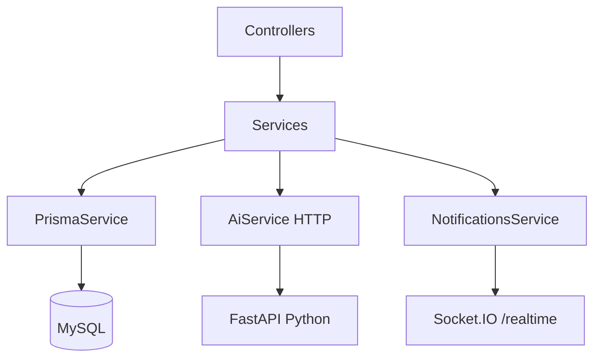
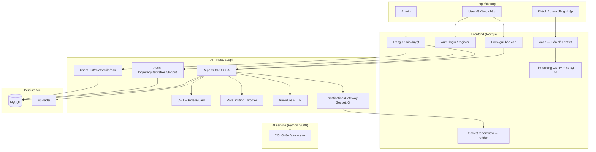
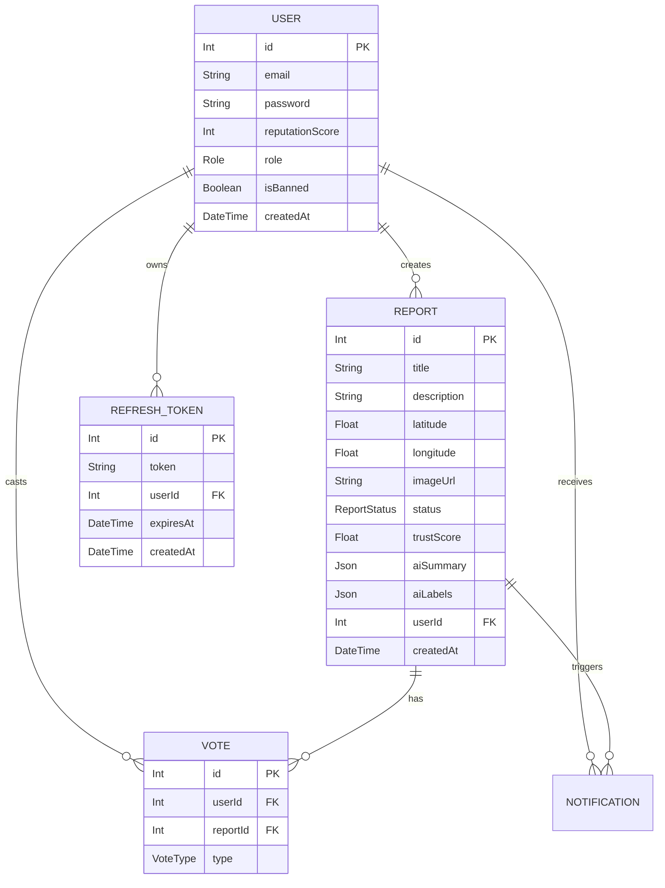

# SYSTEM_ARCHITECTURE — UrbanGuard

## 0) Scope & Snapshot

Tài liệu này mô tả kiến trúc **full stack** hiện tại: `backend/`, `frontend/`, `ai-service/` và tham chiếu `docs/`.

### Backend

- Framework: **NestJS 10** + TypeScript
- Database: **MySQL** + **Prisma ORM**
- Auth: **JWT Access Token (15p)** + **Refresh Token (7 ngày)** lưu DB + Passport (`JwtAuthGuard`, `JwtStrategy`, `RolesGuard`)
- Bảo mật mở rộng: **Rate limiting** (`@nestjs/throttler` — login 5 req/60s, reports 10 req/60s), **giới hạn 3 thiết bị** đồng thời (tự xóa phiên cũ nhất)
- AI: **FastAPI + Ultralytics YOLOv8n** (Python, process riêng) — `POST /ai/analyze`; gọi qua `AiModule` (`@nestjs/axios`)
- Realtime: **Socket.IO** namespace `/realtime`, sự kiện `report:new`
- Upload: **Multer** → `backend/uploads/`, phục vụ qua static `/uploads/`
- API prefix: `/api`
- Swagger UI: **`/api/docs`**

### Frontend

- **Next.js** (App Router) + React + TypeScript + Tailwind CSS
- Bản đồ: **Leaflet** + **react-leaflet** + **OpenStreetMap** tiles
- Routing tìm đường: **leaflet-routing-machine** + **OSRM** công khai
- Realtime: **socket.io-client** → `/realtime`, lắng nghe `report:new` → refetch active reports
- Auth: JWT Bearer token lưu phía client
- Trang chính: `/` (landing), `/map` (bản đồ + routing + né sự cố)

### AI service

- **FastAPI** + **Uvicorn** + **Ultralytics YOLOv8n** (COCO, lọc nhãn giao thông)
- Endpoint chính: `POST /ai/analyze` — nhận `{ image_path }`, trả `detected`, `confidence`, `labels`, `predict`
- Endpoint tương thích: `POST /predict`
- Health check: `GET /health`
- Swagger AI: `http://localhost:8000/docs`

---

## 1) Layered Architecture (Kiến trúc phân tầng)

### 1.1 Phân tầng tổng thể

Hệ thống theo mô hình **module-based + layered**:

1. **Controller Layer** — Nhận HTTP request, bind DTO, áp Guard, gọi Service
2. **Service Layer** — Chứa nghiệp vụ cốt lõi (auth, reports, AI, notifications)
3. **Prisma Layer** — Truy cập DB thông qua `PrismaService` (global)
4. **Persistence Layer** — MySQL: `users`, `reports`, `votes`, `refresh_tokens`, `notifications`

### 1.2 Module NestJS hiện có

| Module | Vai trò | Thành phần chính |
|--------|---------|-----------------|
| `AuthModule` | Đăng ký / đăng nhập / refresh / logout / đổi mật khẩu + JWT strategy | `AuthController`, `AuthService`, `JwtStrategy`, `JwtAuthGuard`, `RolesGuard` |
| `UsersModule` | Quản lý user, role, profile, ban | `UsersController`, `UsersService` |
| `ReportsModule` | CRUD báo cáo, tích hợp AI, emit Socket | `ReportsController`, `ReportsService` |
| `AiModule` | Gọi Python FastAPI `/ai/analyze` | `AiService` (HTTP → Python) |
| `NotificationsModule` | Gateway Socket.IO `/realtime`, emit `report:new` | `NotificationsGateway`, `NotificationsService` |
| `AdminModule` | Khung admin — mở rộng sau | stub |
| `StatisticsModule` | Thống kê, heatmap data — mở rộng sau | stub |
| `UploadsModule` | Khung upload | stub (upload chính qua Multer trong Reports) |
| `MapModule` | Khung map | stub |
| `PrismaModule` | Global DB access | `PrismaService` |

### 1.3 Sơ đồ phân tầng (Mermaid)



### 1.4 Sơ đồ chức năng (functional map)



---

## 2) API & Endpoint Map

> Tất cả route đều có tiền tố `/api` từ `main.ts`.

### 2.1 Hạ tầng

| Method | Path | Guard | Mô tả |
|--------|------|-------|-------|
| GET | `/health` | None | Health check |
| N/A | `/api/docs` | None | Swagger UI |
| GET | `/uploads/*` | None | Static file ảnh báo cáo |

### 2.2 Auth APIs

| Method | Path | Guard | Mô tả | Trạng thái |
|--------|------|-------|-------|-----------|
| POST | `/auth/register` | None | Đăng ký, hash bcrypt | ✅ |
| POST | `/auth/login` | Throttle 5/60s | JWT + refresh token, giới hạn 3 thiết bị | ✅ |
| GET | `/auth/me` | JWT | Profile từ token | ✅ |
| POST | `/auth/refresh` | None | Đổi refresh → cặp token mới | ✅ |
| PATCH | `/auth/password` | JWT | Đổi mật khẩu | ✅ |
| POST | `/auth/logout` | JWT | Xóa 1 refresh token | ✅ |
| POST | `/auth/logout-all` | JWT | Xóa tất cả refresh token | 🔨 |

### 2.3 Users APIs

| Method | Path | Guard | Mô tả | Trạng thái |
|--------|------|-------|-------|-----------|
| GET | `/users` | JWT + ADMIN | Danh sách user, filter role, phân trang | ✅ |
| PATCH | `/users/:id/role` | JWT + ADMIN | Gán role qua API | ✅ |
| GET | `/users/:id/profile` | JWT | reputationScore + totalReports | ✅ |
| PATCH | `/users/:id/ban` | JWT + ADMIN | Khóa / mở khóa tài khoản | 🔨 |
| DELETE | `/users/:id` | JWT + ADMIN | Xóa tài khoản | 🔨 |

### 2.4 Reports APIs

| Method | Path | Guard | Mô tả | Trạng thái |
|--------|------|-------|-------|-----------|
| GET | `/reports/active` | None | Chỉ VALIDATED — dùng cho map | ✅ |
| POST | `/reports` | JWT + Throttle 10/60s | Tạo báo cáo + AI auto-validate | ✅ |
| PATCH | `/reports/:id/status` | JWT + ADMIN | PENDING → VALIDATED / REJECTED | ✅ |
| GET | `/reports` | JWT + ADMIN | Danh sách tất cả báo cáo, filter | 🔨 Dev A |
| GET | `/reports/:id` | JWT + ADMIN | Chi tiết 1 báo cáo | 🔨 Dev A |
| DELETE | `/reports/:id` | JWT + ADMIN | Xóa báo cáo + file | 🔨 Dev A |
| POST | `/reports/:id/vote` | JWT | UPVOTE / DOWNVOTE | 🔨 Dev C |

### 2.5 Admin APIs

| Method | Path | Guard | Mô tả | Trạng thái |
|--------|------|-------|-------|-----------|
| GET | `/admin/reports/pending` | JWT + ADMIN | Queue duyệt PENDING | 🔨 Dev A |

### 2.6 Statistics APIs

| Method | Path | Guard | Mô tả | Trạng thái |
|--------|------|-------|-------|-----------|
| GET | `/statistics/overview` | JWT + ADMIN | Tổng quan, tỉ lệ auto-validated | 🔨 Dev C |
| GET | `/statistics/heatmap-data` | None | Tọa độ + mật độ cho Leaflet heatmap | 🔨 Dev C |

---

## 3) Luồng nghiệp vụ chính

### 3.1 Luồng tạo báo cáo + AI

```
User POST /api/reports (JWT, multipart ảnh)
  → Multer lưu file vào uploads/, tạo Report PENDING
  → AiService.analyze(filename) → FastAPI POST /ai/analyze
      confidence > 0.7  → VALIDATED, trustScore=15, aiLabels, reputation +5
      confidence < 0.5  → PENDING chờ admin
      lỗi AI            → PENDING, aiSummary ghi lỗi
  → NotificationsService.emitReportNew() → Socket report:new
  → Client map refetch GET /api/reports/active
```

### 3.2 Luồng auth + refresh token

```
Đăng nhập → access_token (15p) + refresh_token (7 ngày) lưu DB
  → Tối đa 3 thiết bị đồng thời (xóa phiên cũ nhất nếu vượt)

Access token hết hạn:
  POST /auth/refresh → kiểm tra DB → xóa token cũ → cấp cặp mới

Đăng xuất:
  POST /auth/logout     → xóa 1 refresh token
  POST /auth/logout-all → xóa tất cả (🔨)
```

### 3.3 Luồng admin duyệt báo cáo

```
Admin GET /api/admin/reports/pending (🔨 Dev A)
  → Xem danh sách PENDING + aiSummary
  → PATCH /api/reports/:id/status → VALIDATED / REJECTED
  → VALIDATED: emit report:new → map cập nhật realtime
```

### 3.4 Luồng tìm đường né sự cố (Frontend)

```
User nhập điểm đến trên /map
  → leaflet-routing-machine gọi OSRM public
  → routingService kiểm tra polyline vs incident buffer (115m)
  → Có sự cố trên lộ trình: computeDetourWaypoint() chèn waypoint né
  → Hiển thị banner cảnh báo vàng với aiLabels
```

---

## 4) Tiến trình & cổng mặc định (development)

| Process | Cổng | Lệnh |
|---------|------|------|
| MySQL | 3306 | XAMPP / local |
| NestJS API | 3000 | `cd backend && npm run start:dev` |
| FastAPI AI | 8000 | `cd ai-service && uvicorn main:app --reload --port 8000` |
| Next.js | 3001 | `cd frontend && npx next dev --turbopack -p 3001` |

### Biến môi trường chính

| Biến | Nơi đặt | Ý nghĩa |
|------|---------|---------|
| `DATABASE_URL` | `backend/.env` | Prisma → MySQL |
| `JWT_SECRET` | `backend/.env` | Access token secret |
| `JWT_EXPIRES_IN` | `backend/.env` | Thời hạn access token (15m) |
| `JWT_REFRESH_SECRET` | `backend/.env` | Refresh token secret (khác access) |
| `JWT_REFRESH_EXPIRES_IN` | `backend/.env` | Thời hạn refresh token (7d) |
| `AI_SERVICE_URL` | `backend/.env` | Gốc Python, không `/` cuối |
| `PORT` | `backend/.env` | Cổng Nest (mặc định 3000) |
| `NEXT_PUBLIC_API_URL` | `frontend/.env.local` | Gốc backend |

---

## 5) Database Schema



**Enum:**

| Enum | Giá trị |
|------|---------|
| `Role` | `USER`, `ADMIN` |
| `ReportStatus` | `PENDING`, `VALIDATED`, `REJECTED`, `RESOLVED`, `VERIFIED` |
| `VoteType` | `UPVOTE`, `DOWNVOTE` |

---

## 6) Bảo mật

| Cơ chế | Chi tiết |
|--------|---------|
| Bcrypt | Hash mật khẩu, SALT_ROUNDS = 10 |
| JWT dual secret | Access: `JWT_SECRET` · Refresh: `JWT_REFRESH_SECRET` khác nhau |
| Token rotation | Mỗi refresh → xóa token cũ, cấp token mới |
| Giới hạn thiết bị | Tối đa 3 phiên đồng thời, tự xóa phiên cũ nhất |
| Rate limiting | `@nestjs/throttler` — login 5/60s, reports 10/60s |
| RolesGuard | Kiểm tra role ADMIN trước mọi admin endpoint |
| Ban user | `isBanned` — chặn đăng nhập (🔨 đang làm) |
| CORS | Chỉ cho phép origin từ `CORS_ORIGIN` trong `.env` |

---

## 7) Rủi ro vận hành

| Rủi ro | Hệ quả / xử lý |
|--------|----------------|
| AI tắt / lỗi | Báo cáo vẫn tạo, PENDING, admin duyệt sau |
| MySQL down | API lỗi toàn phần |
| OSRM / OSM ngoài | Chỉ ảnh hưởng tìm đường và tile trên client |
| OSRM public rate limit | Cần self-host khi scale |
| Token refresh DB quá nhiều | Giới hạn 3 thiết bị tránh tích lũy vô hạn |

---

## 8) Task còn lại theo dev

| Dev | Task | Ưu tiên |
|-----|------|---------|
| **Dev A** | GET /reports, GET /reports/:id, GET /admin/reports/pending | P1 |
| **Dev A** | DELETE /reports/:id | P2 |
| **Dev B** | POST /auth/logout-all | P2 |
| **Dev B** | PATCH /users/:id/ban | P2 |
| **Dev B** | DELETE /users/:id | P3 |
| **Dev C** | POST /reports/:id/vote, PATCH RESOLVED, dọn file | P2 |
| **Dev C** | Statistics, heatmap, cron, Socket update | P3 |
| **Dev D** | Trang admin (chờ Dev A P1) | P1 |
| **Dev D** | Form gửi báo cáo, heatmap UI, model AI | P2-P3 |

---

## 9) Quick Traceability (File tham chiếu chính)

### Backend

- Bootstrap: `backend/src/main.ts`
- App wiring: `backend/src/app.module.ts`
- Auth: `backend/src/auth/*`
- Users: `backend/src/users/*`
- Reports: `backend/src/reports/*`
- AI: `backend/src/ai/*`
- Notifications: `backend/src/notifications/*`
- Prisma schema: `backend/prisma/schema.prisma`

### Frontend

- App entry: `frontend/src/app/`
- Bản đồ: `frontend/src/app/map/`
- Routing service: `frontend/src/services/routingService.ts`
- Socket client: `frontend/src/services/socket.ts`

### AI service

- Entry: `ai-service/main.py`
- Analyze endpoint: `ai-service/routers/analyze.py`

### Docs

- `docs/01-system-design/system-architecture.md`
- `docs/01-system-design/database-design.md`
- `AUTH_USERS_FLOW.md`
- `TASK_ASSIGNMENT_v2.md`

---

*UrbanGuard — Bảo vệ bạn trên mọi cung đường*