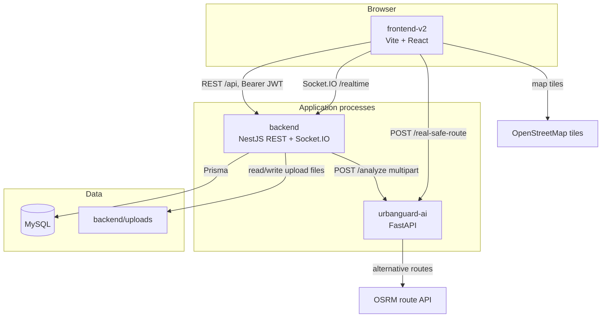
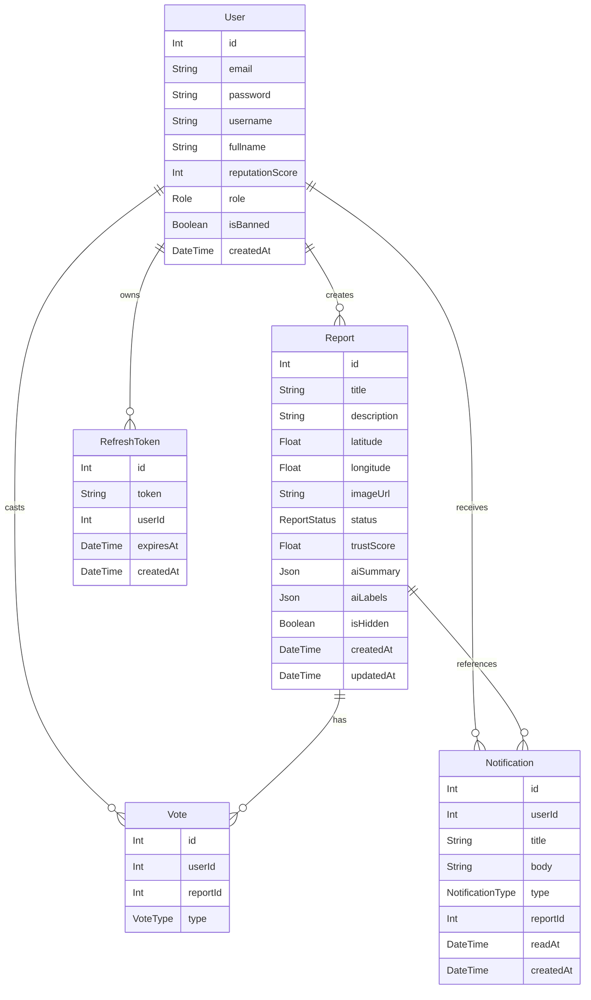
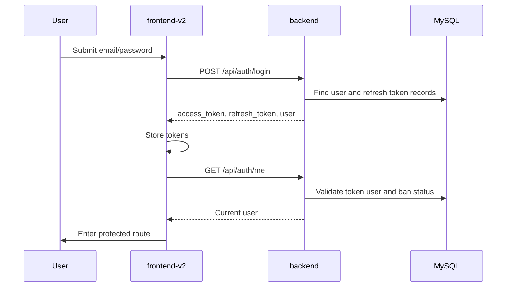
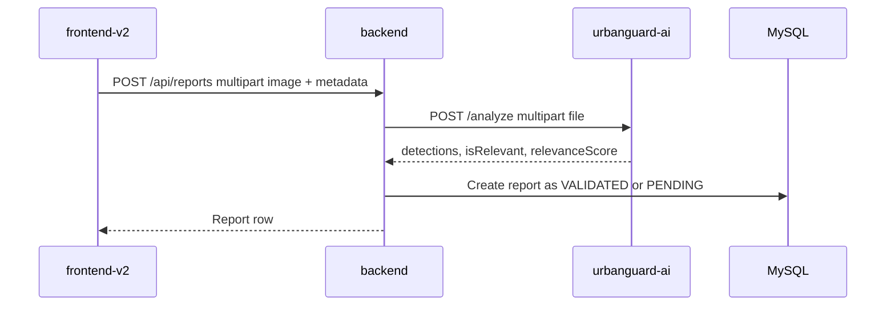
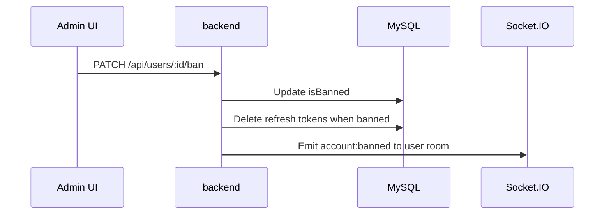

# UrbanGuard System Architecture

This document reflects the current codebase shape for `backend/`, `frontend-v2/`, and `urbanguard-ai/`. Forum apps are separate and are not part of this architecture snapshot.

## 1. Containers

```mermaid
flowchart TB
  subgraph browser["Browser"]
    FE["frontend-v2\nVite + React"]
  end

  subgraph server["Application processes"]
    API["backend\nNestJS REST + Socket.IO"]
    AI["urbanguard-ai\nFastAPI"]
  end

  subgraph data["Data"]
    DB[("MySQL")]
    FS["backend/uploads"]
  end

  OSM["OpenStreetMap tiles"]
  OSRM["OSRM route API"]

  FE -->|"REST /api, Bearer JWT"| API
  FE -->|"Socket.IO /realtime"| API
  FE -->|"POST /real-safe-route"| AI
  FE -->|"map tiles"| OSM
  API -->|"Prisma"| DB
  API -->|"read/write upload files"| FS
  API -->|"POST /analyze multipart"| AI
  AI -->|"alternative routes"| OSRM
```

## 2. Backend

| Layer | Implementation |
|---|---|
| Framework | NestJS 11 |
| API prefix | `/api` |
| Database access | Prisma Client |
| Database | MySQL |
| Auth | Passport JWT, bcrypt, refresh tokens in DB |
| Authorization | `RolesGuard` and `@Roles(Role.ADMIN)` |
| Uploads | Multer disk storage under `backend/uploads/reports` |
| Realtime | Socket.IO namespace `/realtime` |
| API docs | Swagger at `/api/docs` |

### Backend modules

| Module | Current responsibility |
|---|---|
| `auth` | Register, login, refresh, logout, password change, `/auth/me` |
| `users` | Admin user list, role update, ban/unban, profile |
| `reports` | Active reports and authenticated report creation |
| `vote` | Report upvote/downvote toggle |
| `admin` | Pending-report queue |
| `notifications` | Notification CRUD and Socket.IO gateway |
| `statistics` | Overview and heatmap data |
| `ai` | Calls FastAPI `/analyze` |
| `uploads`, `map`, `ai-review` | Placeholder/info endpoints |
| `prisma` | Shared Prisma service |

## 3. Frontend

| Area | Implementation |
|---|---|
| Build tool | Vite |
| UI | React 19, TypeScript, Tailwind |
| Routing | `react-router-dom` |
| Map | Leaflet, React Leaflet, marker clustering |
| Realtime | `socket.io-client` |
| Charts | Recharts |
| API base env | `VITE_API_URL`, default `http://localhost:3000` |

### Frontend route groups

| Route | Purpose |
|---|---|
| `/` | Landing page |
| `/login`, `/register` | Auth |
| `/map` | Active reports map and safe route UI |
| `/report` | Create report |
| `/notifications` | User notifications |
| `/profile` | Current user profile |
| `/settings` | Local settings UI |
| `/account-management` | Admin user management |
| `/report-management` | Admin report management UI |
| `/forum` | Placeholder route; sidebar currently links forum externally |

## 4. AI Service

`urbanguard-ai` is a FastAPI app. It is used by both backend report creation and frontend safe-route calculation.

| Endpoint | Caller | Purpose |
|---|---|---|
| `POST /analyze` | Backend | Analyze uploaded incident image |
| `POST /safe-route` | Optional/manual | Basic safe route helper |
| `POST /real-safe-route` | Frontend | Calculate route using coordinate points and danger list |
| `GET /docs` | Developer | FastAPI docs |

## 5. Data Model

```mermaid
erDiagram
  User ||--o{ Report : creates
  User ||--o{ Vote : casts
  User ||--o{ Notification : receives
  User ||--o{ RefreshToken : owns
  Report ||--o{ Vote : has
  Report ||--o{ Notification : references

  User {
    Int id
    String email
    String password
    String username
    String fullname
    Int reputationScore
    Role role
    Boolean isBanned
    DateTime createdAt
  }

  Report {
    Int id
    String title
    String description
    Float latitude
    Float longitude
    String imageUrl
    ReportStatus status
    Float trustScore
    Json aiSummary
    Json aiLabels
    Boolean isHidden
    DateTime createdAt
    DateTime updatedAt
  }

  Vote {
    Int id
    Int userId
    Int reportId
    VoteType type
  }

  Notification {
    Int id
    Int userId
    String title
    String body
    NotificationType type
    Int reportId
    DateTime readAt
    DateTime createdAt
  }

  RefreshToken {
    Int id
    String token
    Int userId
    DateTime expiresAt
    DateTime createdAt
  }
```

## 6. Core Flows

### 6.1 Login and current user

```mermaid
sequenceDiagram
  participant U as User
  participant FE as frontend-v2
  participant API as backend
  participant DB as MySQL

  U->>FE: Submit email/password
  FE->>API: POST /api/auth/login
  API->>DB: Find user and refresh token records
  API-->>FE: access_token, refresh_token, user
  FE->>FE: Store tokens
  FE->>API: GET /api/auth/me
  API->>DB: Validate token user and ban status
  API-->>FE: Current user
  FE->>U: Enter protected route
```

Important behavior:

- A banned user is rejected during login.
- Existing access tokens are also rejected on protected requests because `JwtStrategy` re-checks `isBanned`.
- Frontend clears tokens only when `/auth/me` returns `401` or `403`.

### 6.2 Create report

```mermaid
sequenceDiagram
  participant FE as frontend-v2
  participant API as backend
  participant AI as urbanguard-ai
  participant DB as MySQL

  FE->>API: POST /api/reports multipart image + metadata
  API->>AI: POST /analyze multipart file
  AI-->>API: detections, isRelevant, relevanceScore
  API->>DB: Create report as VALIDATED or PENDING
  API-->>FE: Report row
```

Known behavior:

- Image is required.
- Backend currently accepts report body as raw multipart fields and validates required title/description/finite coordinates in service code.
- AI failure currently fails report creation instead of creating a recoverable pending report.

### 6.3 Admin user ban

```mermaid
sequenceDiagram
  participant Admin as Admin UI
  participant API as backend
  participant DB as MySQL
  participant WS as Socket.IO

  Admin->>API: PATCH /api/users/:id/ban
  API->>DB: Update isBanned
  API->>DB: Delete refresh tokens when banned
  API->>WS: Emit account:banned to user room
```

## 7. Realtime

Socket namespace: `/realtime`

| Event | Direction | Current use |
|---|---|---|
| `report:new` | Backend to all clients | Map can refetch active reports |
| `report:update` | Backend to all clients | Map can refetch active reports |
| `account:banned` | Backend to `user:{id}` room | Banned modal on frontend |
| `notification:new` | Expected by frontend | Not fully emitted by backend yet |

## 8. Known Contract Gaps

| Gap | Impact |
|---|---|
| `frontend-v2` report management calls `GET /api/reports`, `GET /api/reports/:id`, `PATCH /api/reports/:id/status`, `DELETE /api/reports/:id`, but backend does not expose them yet | Admin report management cannot complete approve/reject/delete flows |
| Vote backend returns `{ vote, newTrustScore }`, while frontend popup expects `{ trustScore, userVote }` | Vote UI can show stale or undefined state |
| `GET /api/reports/active` does not return current user's vote | Vote buttons cannot remain highlighted after reload |
| AI service is a hard dependency during report creation | AI outage can fail report submission |
| Full frontend lint still has non-user/auth issues | CI quality gate may fail even when user/auth targeted lint passes |

## 9. Verification Status

Last checked in this review session:

| Check | Result |
|---|---|
| `backend npx tsc --noEmit` | Pass |
| `backend npm test` | Pass |
| `backend npm run build` | Pass |
| `frontend-v2 npx tsc --noEmit -p tsconfig.app.json` | Pass |
| `frontend-v2 npm run build` | Pass |
| Targeted frontend lint for user/auth files | Pass |
| Full frontend lint | Fails on existing non-user/auth files |
| Live backend startup | Blocked by MySQL `P1001` in this environment |

