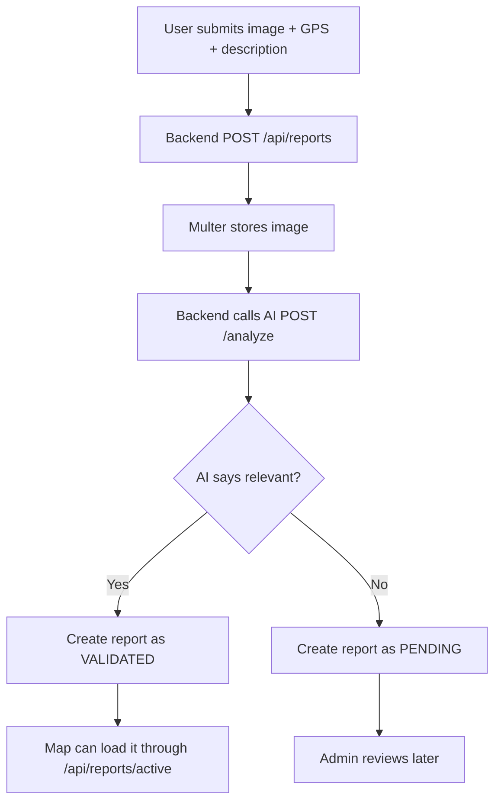

# UrbanGuard Product Overview

UrbanGuard helps citizens report urban traffic and road-safety incidents, then shows trusted incidents on a live map so users can avoid dangerous areas.

## Product Goals

- Make it easy to submit a road incident with an image, description, and GPS location.
- Use AI to assist the first review of incident images.
- Let admins manage users and review pending reports.
- Show validated reports on a map with danger markers and route assistance.
- Keep authentication and banned-user handling consistent across backend and frontend.

## Active Applications

| App | Path | Purpose |
|---|---|---|
| Backend API | `backend/` | REST API, auth, reports, users, notifications, statistics |
| Web app | `frontend-v2/` | Main user/admin UI |
| AI service | `urbanguard-ai/` | Image analysis and safe-route service |
| Forum apps | `forum-backend/`, `forum-frontend/` | Separate forum scope |

## Technology

### Backend

- NestJS
- Prisma ORM
- MySQL
- JWT + Passport
- bcrypt
- Multer
- Socket.IO
- Swagger

### Frontend v2

- Vite
- React
- TypeScript
- Tailwind CSS
- React Router
- Leaflet / React Leaflet
- Recharts
- Socket.IO client

### AI

- FastAPI
- Python
- Image analyzer service
- OSRM-based route helpers

## Main User Features

- Register and login.
- Keep session through current-user context.
- Submit a new incident report.
- View validated incidents on a map.
- Vote on reports.
- View and manage notifications.
- View profile and settings.

## Main Admin Features

- List users with filters and stats.
- Promote/demote user roles.
- Ban or unban users.
- View pending report queue.
- Use report-management UI; some backend report-management endpoints are still missing.

## Report Flow

## Auth And Ban Flow

- Login returns an access token and refresh token.
- Frontend stores tokens and immediately loads `/api/auth/me`.
- `JwtStrategy` checks the user in DB on protected requests.
- Banned users are rejected even if their access token has not expired.
- When admin bans a user, refresh tokens are deleted and `account:banned` is emitted over Socket.IO.

## Map And Safe Route

- `GET /api/reports/active` returns validated, non-hidden reports.
- The map displays danger markers, danger zones, clustering, and heatmap data.
- Safe-route UI sends current danger points to `urbanguard-ai` through `/real-safe-route`.
- The AI service evaluates alternatives and returns selected route coordinates for Leaflet.

## Current Known Gaps

| Area | Gap |
|---|---|
| Report management | Frontend expects list/detail/status/delete report endpoints that backend does not expose yet |
| Vote | Backend and frontend response contracts need alignment |
| Notifications | Frontend listens for `notification:new`, but backend emission is not fully wired |
| AI failure | Report creation currently fails if the AI call fails |
| Lint | Full frontend lint has existing issues outside the recent user/auth work |

## Documentation

| File | Purpose |
|---|---|
| `README.md` | Setup and current API snapshot |
| `SYSTEM_ARCHITECTURE.md` | Current architecture |
| `AUTH_USERS_FLOW.md` | Auth/user flow |
| `READ-RUN.md` | Local run commands |
| `frontend-v2/README.md` | Frontend-specific notes |
| `docs/README.md` | Documentation index |

## Slogan

UrbanGuard - safer routes through shared awareness.

