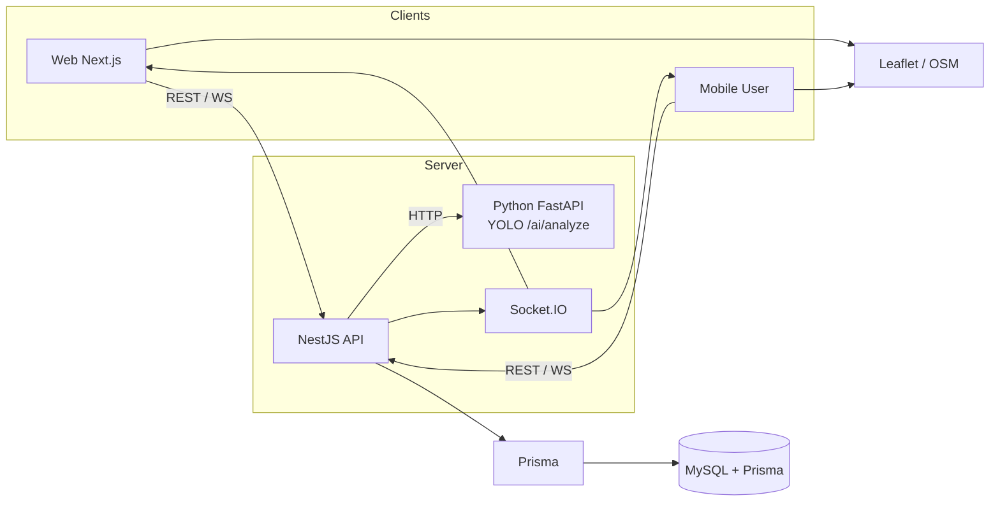
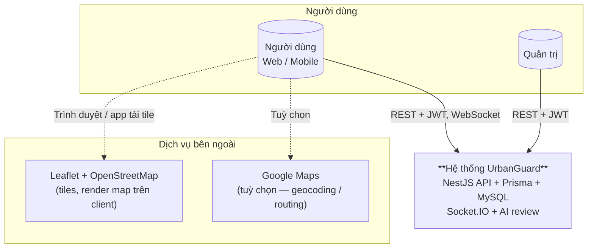
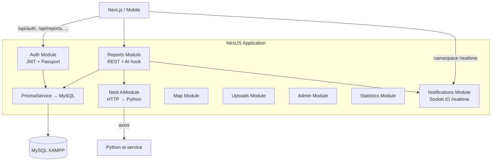
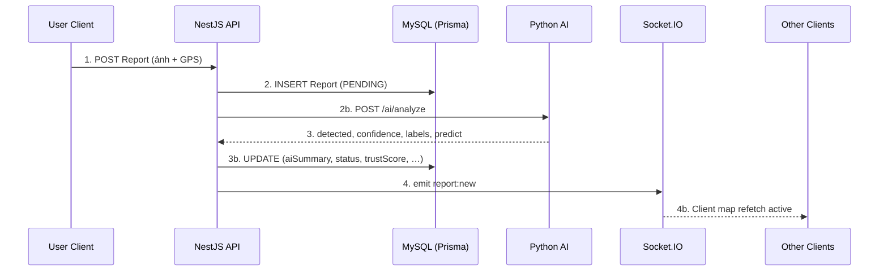

# Kiến trúc hệ thống UrbanGuard

Tài liệu này mô tả kiến trúc tổng thể của **UrbanGuard** — hệ thống bản đồ cảnh báo sự cố giao thông đô thị — căn cứ `UrbanGuard.md`, `UrbanGuard_description.txt` và khung tài liệu trong `UrbanGuard_Docs_Structure.md`. Cơ sở dữ liệu triển khai thực tế dùng **MySQL (XAMPP)** thay cho CockroachDB, truy cập qua **Prisma ORM**.

> **Kiến trúc triển khai (containers, cổng, ranh giới):** xem [`system-architecture.md`](./system-architecture.md).

---

## 1. Tổng quan kiến trúc (High-level)

Hệ thống theo mô hình **client–server**: các ứng dụng phía người dùng chỉ giao tiếp với **một API trung tâm**; logic nghiệp vụ, AI, realtime và truy cập dữ liệu được tập trung ở server.

| Thành phần | Vai trò |
|------------|---------|
| **Client — Web (Next.js)** | Giao diện người dùng: bản đồ (Leaflet), gửi báo cáo (ảnh + GPS), đăng nhập, vote, nhận cập nhật realtime. |
| **Client — Mobile User** | Cùng kiểu tương tác với Web: REST API + (tuỳ chọn) Socket.IO client; phù hợp mở rộng ứng dụng native/React Native sau này. |
| **Server — NestJS API** | Điều phối: xác thực JWT, module báo cáo, upload, AI review, thống kê, admin; phát sự kiện realtime qua **Socket.IO**. |
| **Database — MySQL (XAMPP)** | Lưu trữ bền vững: user, report, vote (trust score); truy cập thống nhất qua **Prisma** (type-safe, migration). |
| **Dịch vụ ngoài** | **Leaflet + OSM** (tiles trên client); **OSRM** (routing công khai) qua **leaflet-routing-machine** trên Next.js. |
| **AI service (Python)** | **FastAPI** + YOLOv8n — Nest gọi HTTP **`/ai/analyze`**; đọc ảnh từ `backend/uploads`. |

Luồng tổng quát (khớp mô tả dự án: *User → Server → AI → DB → Map*):

---

## 2. C4 Model

### 2.1. Level 1 — System Context

Ngữ cảnh hệ thống: người dùng, UrbanGuard và các hệ thống bên ngoài phục vụ bản đồ (Leaflet/OSM; Google Maps tuỳ chọn).

> Mermaid [C4](https://mermaid.js.org/syntax/c4.html) có thể bật trên một số viewer; sơ đồ `flowchart` trên tương đương **C4 Level 1 — System Context** và tương thích rộng hơn.

### 2.2. Level 2 — Containers (logic trong NestJS)

Chia nhỏ **một ứng dụng NestJS** thành các “container” logic (module) tương ứng code thực tế trong repo:

- **Auth Module**: đăng ký (bcrypt), đăng nhập (JWT), `RolesGuard`.  
- **Reports Module**: `POST/GET/PATCH` báo cáo; sau create gọi **`AiService`**, cập nhật `aiSummary`, `aiLabels`, `trustScore`, `status` (auto **VALIDATED** hoặc **PENDING**).  
- **AiModule (`backend/src/ai/`)**: HTTP client tới **Python** `{AI_SERVICE_URL}/ai/analyze`.  
- **Notifications**: **Socket.IO** `report:new` (và `report:update` nếu dùng sau này) namespace **`/realtime`**.

---

## 3. Luồng dữ liệu (Data Flow)

Luồng nghiệp vụ chính từ lúc user gửi báo cáo đến khi người khác thấy marker cập nhật:

| Bước | Mô tả |
|------|--------|
| **1** | User **POST /api/reports** (multipart + JWT). |
| **2** | Nest lưu **MySQL** + file `uploads/`; gọi **Python `POST /ai/analyze`** (`image_path` = tên file). |
| **3** | Cập nhật `aiSummary`, `aiLabels`, `trustScore`, `status` (có thể **VALIDATED** ngay nếu `detected` + `confidence` > 0.7). |
| **4** | **`report:new`** qua Socket.IO; **Next.js `/map`** refetch `GET /reports/active` và vẽ marker / routing. |

Song song, **Vote** (UPVOTE/DOWNVOTE) và **reputation** người dùng có thể điều chỉnh `trustScore` theo thời gian (chi tiết trong thiết kế module `reports` / `statistics`).

---

## 4. Thành phần công nghệ — lý do lựa chọn

### NestJS (Modular)

- **Module hoá** (`auth`, `reports`, `ai`, `notifications`, …) khớp cấu trúc tài liệu dự án và dễ chia nhóm khi nhóm lớn.  
- Hỗ trợ **DI**, guard, pipe, filter — phù hợp **JWT**, validation DTO, exception filter (ví dụ xử lý trùng email / lỗi Prisma).  
- Một codebase cho REST + WebSocket (`@nestjs/websockets` + `socket.io`).

### MySQL (Reliability)

- **Quen thuộc, ổn định** cho dữ liệu quan hệ (User — Report 1-n, Vote gắn user + report).  
- Chạy local nhanh với **XAMPP**, dễ backup / host production sau này.  
- **Prisma** giảm lỗi SQL thủ công, migration rõ ràng, đồng bộ với TypeScript.

### Socket.IO (Low latency)

- Đẩy **cập nhật bản đồ** và cảnh báo khu vực gần **realtime**, tránh lag do polling danh sách report liên tục.  
- Một namespace (ví dụ `/realtime`) tách biệt khỏi REST, dễ scale horizontal sau (sticky session / adapter Redis khi cần).

---

## 5. Liên kết với mã nguồn và tài liệu khác

| Nội dung | Vị trí trong repo |
|----------|-------------------|
| Schema User / Report / Vote | `backend/prisma/schema.prisma` |
| Auth JWT + bcrypt | `backend/src/auth/` |
| Filter lỗi Prisma (P2002 trùng unique) | `backend/src/common/filters/prisma-client-exception.filter.ts` |
| Socket.IO gateway (`report:new`, …) | `backend/src/notifications/notifications.gateway.ts` |
| Nest `AiService` | `backend/src/ai/ai.service.ts` |
| Python AI | `ai-service/main.py` |
| Swagger | `http://localhost:3000/api/docs` (cấu hình trong `backend/src/main.ts`) |
| Mô tả chức năng & rủi ro | `UrbanGuard_description.txt`, `UrbanGuard.md` |

---

## 6. Kết luận

Kiến trúc UrbanGuard tách bạch **client (Web/Mobile)**, **API NestJS**, **MySQL qua Prisma**, **AI** và **realtime Socket.IO**, phù hợp mục tiêu: báo cáo sự cố có vị trí, đánh giá tin cậy (AI + cộng đồng + admin), hiển thị trên bản đồ và cập nhật nhanh cho người dùng khác.

**Slogan:** UrbanGuard — Bảo vệ bạn trên mọi cung đường.
