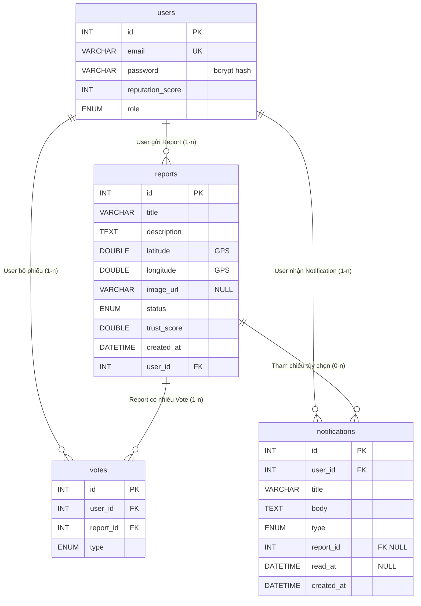

# Thiết kế database — UrbanGuard

Tài liệu mô tả mô hình dữ liệu triển khai trên **MySQL** (đã đồng bộ `backend/prisma/schema.prisma`) và bám sát **`UrbanGuard_description.txt`**: báo cáo có ảnh + GPS, xác minh cộng đồng (vote), **trust score** (AI + user + cộng đồng), **reputation** chống vote ảo/spam, cảnh báo khu vực qua thông báo.

**Nguồn chân lý:** Prisma schema → migrate tạo bảng MySQL; enum và kiểu cột dưới đây mô tả **tương đương vật lý** sau khi migrate (chuỗi `String` thường là `VARCHAR(191)` theo mặc định Prisma cho MySQL).

---

## 1. Data Dictionary

### 1.1. Bảng `users`

Quản lý tài khoản (đăng ký / đăng nhập — mục 3.1), phân quyền **ADMIN** / **USER** (3.8), và **điểm uy tín** phục vụ **reputation system** (3.4) chống **vote ảo**.

| Tên cột (MySQL) | Kiểu dữ liệu MySQL | Ràng buộc | Ý nghĩa |
|-----------------|-------------------|-----------|---------|
| `id` | `INT` | **PK**, `AUTO_INCREMENT`, `NOT NULL` | Định danh duy nhất của người dùng. |
| `email` | `VARCHAR(191)` | **UNIQUE**, `NOT NULL` | Email đăng nhập; ứng dụng nên chuẩn hóa chữ thường để tránh trùng biến thể. |
| `password` | `VARCHAR(191)` | `NOT NULL` | **Hash bcrypt** của mật khẩu — không lưu plaintext (xem [§3. Bảo mật](#3-bảo-mật-và-chống-báo-cáo-ảo)). |
| `reputation_score` | `INT` | `NOT NULL`, mặc định `0` | Điểm uy tín tích luỹ theo hành vi đúng/sai (vote hợp lệ, báo cáo được xác nhận…); dùng để **hạn chế spam và báo cáo ảo** (mục 3.4, 3.5). |
| `role` | `ENUM('ADMIN','USER')` | `NOT NULL`, mặc định `'USER'` | **USER**: gửi báo cáo, vote, xem map; **ADMIN**: kiểm duyệt, xóa báo cáo giả, khóa user. |

---

### 1.2. Bảng `reports`

Lưu **báo cáo sự cố** (3.2): ảnh (URL), GPS, mô tả; rủi ro **fake data / spam** (3.2) được giảm qua AI, giới hạn request, trust score và chính sách theo reputation người gửi.

| Tên cột (MySQL) | Kiểu dữ liệu MySQL | Ràng buộc | Ý nghĩa |
|-----------------|-------------------|-----------|---------|
| `id` | `INT` | **PK**, `AUTO_INCREMENT`, `NOT NULL` | Định danh báo cáo. |
| `title` | `VARCHAR(191)` | `NOT NULL` | Tiêu đề ngắn (loại sự cố, khu vực…). |
| `description` | `TEXT` | `NOT NULL` | Mô tả chi tiết sự cố giao thông. |
| `latitude` | **`DOUBLE`** | `NOT NULL` | Vĩ độ WGS84 — độ chính xác cao cho hiển thị trên bản đồ (Leaflet); Prisma `Float` → MySQL `DOUBLE`. |
| `longitude` | **`DOUBLE`** | `NOT NULL` | Kinh độ WGS84; cùng hệ quy chiếu với `latitude`. |
| `image_url` | `VARCHAR(191)` | `NULL` | Đường dẫn tương đối kiểu `/uploads/...` sau upload. |
| `status` | **ENUM** (Prisma: `PENDING`, `VALIDATED`, `VERIFIED`, `RESOLVED`, `REJECTED`) | `NOT NULL`, mặc định `PENDING` | **VALIDATED** = hiển thị công khai / `GET /reports/active` (AI auto hoặc admin). **REJECTED** = từ chối. **VERIFIED** = legacy trong schema nếu còn dữ liệu cũ. |
| `trust_score` | **`DOUBLE`** | `NOT NULL`, mặc định `0` | Sau AI: ví dụ **15** khi auto-VALIDATED; **0** khi PENDING / lỗi AI. Admin vote có thể mở rộng sau. |
| `ai_summary` | **`JSON`** | `NULL` | Payload phân tích AI (`/ai/analyze` + metadata) hoặc `{ ok: false, error, ... }`. |
| `ai_labels` | **`JSON`** | `NULL` | Mảng string nhãn lớp (YOLO, nhóm giao thông). |
| `created_at` | `DATETIME(3)` | `NOT NULL`, mặc định thời gian hiện tại | Thời điểm tạo báo cáo (phục vụ pagination, cache — 3.3). |
| `user_id` | `INT` | **FK** → `users(id)`, `NOT NULL`, `ON DELETE CASCADE` | **User gửi Report** (quan hệ **1—n**): người tạo báo cáo. |

**Index (trong schema):** `user_id`; `(latitude, longitude)` — hỗ trợ truy vấn theo người dùng và theo vùng địa lý.

---

### 1.3. Bảng `votes`

**Xác nhận cộng đồng** (3.4): vote đúng/sai (**UPVOTE** / **DOWNVOTE**); hỗ trợ cập nhật **trust score** của báo cáo và phản ánh ý kiến đông đảo.

| Tên cột (MySQL) | Kiểu dữ liệu MySQL | Ràng buộc | Ý nghĩa |
|-----------------|-------------------|-----------|---------|
| `id` | `INT` | **PK**, `AUTO_INCREMENT`, `NOT NULL` | Định danh phiếu vote. |
| `user_id` | `INT` | **FK** → `users(id)`, `NOT NULL`, `ON DELETE CASCADE` | User thực hiện vote; **một user nhiều vote** trên các báo cáo khác nhau. |
| `report_id` | `INT` | **FK** → `reports(id)`, `NOT NULL`, `ON DELETE CASCADE` | Báo cáo được vote; **một report nhiều vote** từ nhiều user. |
| `type` | **`ENUM('UPVOTE','DOWNVOTE')`** | `NOT NULL` | Đồng thuận (+) hoặc phản đối (-) với độ tin cậy của báo cáo. |

**Ràng buộc nghiệp vụ:** `UNIQUE (user_id, report_id)` — mỗi user **tối đa một** bản ghi vote cho một report (đổi ý = `UPDATE type` trong logic API).

---

### 1.4. Bảng `notifications`

**Cảnh báo** (3.9 — cảnh báo khu vực nguy hiểm): lưu thông báo gửi tới từng user; có thể gắn tới một **report** cụ thể.

| Tên cột (MySQL) | Kiểu dữ liệu MySQL | Ràng buộc | Ý nghĩa |
|-----------------|-------------------|-----------|---------|
| `id` | `INT` | **PK**, `AUTO_INCREMENT`, `NOT NULL` | Định danh thông báo. |
| `user_id` | `INT` | **FK** → `users(id)`, `NOT NULL`, `ON DELETE CASCADE` | **User nhận Notification** (quan hệ **1—n**). |
| `title` | `VARCHAR(191)` | `NOT NULL` | Tiêu đề ngắn (ví dụ: “Cảnh báo khu vực”). |
| `body` | `TEXT` | `NOT NULL` | Nội dung chi tiết (mô tả khu vực, mức độ, hướng dẫn). |
| `type` | **`ENUM('AREA_ALERT','REPORT_UPDATE','SYSTEM')`** | `NOT NULL`, mặc định `'REPORT_UPDATE'` | **AREA_ALERT**: cảnh báo vùng; **REPORT_UPDATE**: thay đổi trạng thái/uy tín báo cáo; **SYSTEM**: thông báo hệ thống. |
| `report_id` | `INT` | **FK** → `reports(id)`, `NULL`, `ON DELETE SET NULL` | Liên kết báo cáo liên quan (nếu có); xóa report không xóa hàng thông báo đã lưu. |
| `read_at` | `DATETIME(3)` | `NULL` | Thời điểm đọc; `NULL` = chưa đọc. |
| `created_at` | `DATETIME(3)` | `NOT NULL`, mặc định thời gian hiện tại | Thời điểm tạo thông báo. |

---

## 2. Sơ đồ ERD (Mermaid)

Quan hệ cốt lõi theo nghiệp vụ UrbanGuard:

- **User** gửi nhiều **Report** (một—nhiều).
- **Report** có nhiều **Vote** từ nhiều user (một—nhiều); mỗi cặp (user ↔ report) chỉ một vote.
- **User** nhận nhiều **Notification** (một—nhiều).
- **Report** có thể được tham chiếu bởi nhiều notification (khóa ngoại tuỳ chọn).

---

## 3. Bảo mật và chống báo cáo ảo

### 3.1. Mật khẩu — bcrypt

- **`users.password`** chỉ lưu **chuỗi hash do bcrypt tạo** (salt + cost, ví dụ cost 10), **không** lưu mật khẩu thô. Việc này giảm rủ ro khi DB bị lộ; kẻ tấn công không thể “đọc ngược” mật khẩu từ một hash bcrypt hợp lệ.
- **Đăng ký:** `bcrypt.hash(plaintext, rounds)` rồi mới `INSERT`. **Đăng nhập:** `bcrypt.compare(plaintext, hash)` — không so sánh chuỗi tuyến tính.
- Kết hợp thêm biện pháp trong *UrbanGuard_description* (3.1): captcha, OTP, giới hạn tần suất đăng nhập để hạn chế **brute force** — bcrypt bảo vệ **dữ liệu lưu trữ**, không thay thế rate limit.

### 3.2. `reputation_score` — lọc và làm suy giảm báo cáo / vote ảo

Theo mô tả hệ thống, rủi ro **fake data, spam** (3.2) và **vote ảo** (3.4) cần được xử lý bằng **AI**, **giới hạn request** và **reputation system**. Trường **`reputation_score`** trên `users` là **điểm số tích luỹ** phản ánh mức độ “tin cậy” của tài khoản theo thời gian.

**Hướng áp dụng trong logic ứng dụng (không nằm trong DB thuần tuý, nhưng dữ liệu nằm ở bảng `users`):**

| Mục đích | Gợi ý chính sách (triển khai tại tầng API / service) |
|----------|------------------------------------------------------|
| **Giảm báo cáo ảo / spam** | User có `reputation_score` **thấp** (hoặc mới): giới hạn **số báo cáo/ngày**, yêu cầu **PENDING** lâu hơn, ưu tiên đưa vào hàng chờ **AI** hoặc **admin** trước khi hiển thị công khai đầy đủ. |
| **Giảm vote manip** | Vote từ user **uy tín thấp** có thể được **trọng số thấp hơn** khi cập nhật `reports.trust_score`, hoặc bị chặn vote nếu điểm dưới ngưỡng (tùy rule). Ngược lại, user **uy tín cao** củng cố trust score nhanh hơn (3.5). |
| **Tích luỹ điểm** | Tăng điểm khi báo cáo được **VERIFIED** / vote cộng đồng khớp thực tế; giảm điểm khi nhiều báo cáo bị **từ chối**, **DOWNVOTE** mạnh, hoặc admin **khóa** hành vi lạm dụng (3.8). |

Như vậy **`reputation_score`** là **tín hiệu nội bộ** đi cùng **`trust_score` trên từng báo cáo**: báo cáo mô tả *mức tin của nội dung*, reputation mô tả *mức tin của người gửi / người vote*, cùng AI và admin tạo thành lớp **lọc báo cáo ảo** phù hợp tài liệu dự án.

### 3.3. Tọa độ GPS và kiểu `ENUM` (tóm tắt kỹ thuật)

- **`latitude` / `longitude`:** kiểu **`DOUBLE`** trên MySQL (Prisma `Float`) — đủ độ phân giải cho **WGS84** và đặt marker chính xác khi tích hợp **Leaflet** / tile OSM.
- **`status` (báo cáo), `type` (vote / notification), `role` (user):** dùng **`ENUM`** trong MySQL — tập giá trị cố định, giảm nhập sai, thuận tiện lọc và báo cáo thống kê.

---

## 4. Liên kết

| Tài nguyên | Đường dẫn |
|------------|-----------|
| Schema Prisma | `backend/prisma/schema.prisma` |
| Kiến trúc hệ thống | [architecture.md](./architecture.md) |
| Mô tả chức năng & rủi ro | `UrbanGuard_description.txt` |
