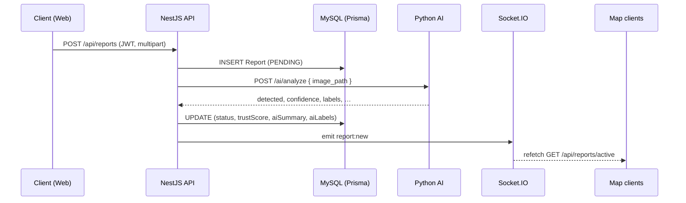

# Luồng xử lý (Sequence / flow)

## Tạo báo cáo + AI + realtime

Luồng đã triển khai trong code (xem thêm [`architecture.md`](./architecture.md)):

## Admin duyệt PENDING → VALIDATED

1. Admin **PATCH** `/api/reports/:id/status` với body VALIDATED.
2. Transaction: kiểm tra đang PENDING → cập nhật DB, cộng reputation user.
3. Nếu VALIDATED → **`report:new`** để bản đồ cập nhật marker.

## Đọc bản đồ (không sequence)

- Bất kỳ client nào: **GET** `/api/reports/active` — không cần đăng nhập.
