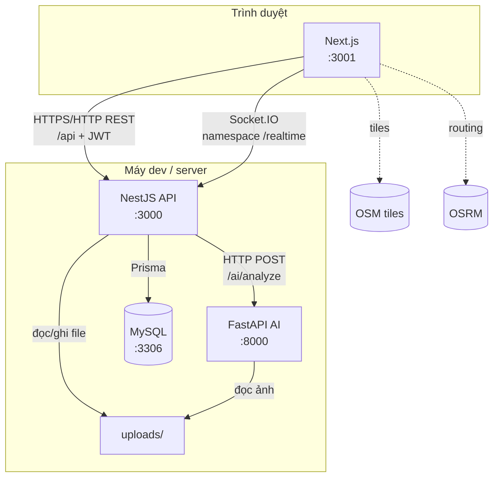

# System architecture — UrbanGuard

Tài liệu mô tả **kiến trúc hệ thống** ở mức triển khai và ranh giới dịch vụ: các process chạy độc lập, giao thức giao tiếp, lưu trữ và luồng nghiệp vụ chính. Chi tiết mô hình C4 và giải thích sâu hơn nằm trong [`architecture.md`](./architecture.md).

---

## 1. Mục tiêu kiến trúc

- Tách **giao diện** (Next.js), **API nghiệp vụ** (NestJS) và **suy luận AI** (Python) để scale và deploy độc lập.
- Một nguồn sự thật dữ liệu quan hệ: **MySQL** qua **Prisma**.
- Cập nhật bản đồ gần **realtime** qua **Socket.IO** thay vì polling liên tục.
- Ảnh báo cáo lưu **filesystem** (`backend/uploads/`), metadata và kết quả AI lưu **DB**.

---

## 2. Các thành phần (logical containers)

| Thành phần | Công nghệ | Vai trò |
|------------|-----------|---------|
| **Web app** | Next.js (React) | UI, Leaflet/OSM, routing OSRM (client), gọi REST, Socket client |
| **API** | NestJS | JWT, REST `/api/*`, upload Multer, điều phối AI, emit Socket |
| **AI worker** | FastAPI + YOLOv8n | `POST /ai/analyze` — đọc file ảnh theo tên file trong uploads |
| **Database** | MySQL | User, Report, Vote, … (schema Prisma) |
| **Object storage (local)** | Thư mục `uploads/` | File ảnh; URL phục vụ qua Nest (`/uploads/...`) |
| **External map tiles** | OSM CDN | Tiles map trên trình duyệt (không qua Nest) |
| **External routing** | OSRM (public) | Tính tuyến từ leaflet-routing-machine trên client |

---

## 3. Sơ đồ triển khai (development / mặc định repo)

Các process thường chạy trên **ba cổng** khác nhau (ví dụ local):

---

## 4. Ranh giới và giao thức

| Biên | Giao thức | Ghi chú |
|------|-----------|---------|
| Browser ↔ Nest | HTTP(S) REST, `Authorization: Bearer` | Prefix `/api` |
| Browser ↔ Nest | WebSocket (Socket.IO) | Namespace **`/realtime`**, sự kiện **`report:new`** |
| Nest ↔ MySQL | TCP, Prisma | `DATABASE_URL` |
| Nest ↔ Python AI | HTTP JSON | **`AI_SERVICE_URL`** không có `/` cuối; body `{ "image_path": "<filename>" }` |
| Python ↔ Ảnh | Đọc file local | `UPLOADS_ROOT` hoặc layout mặc định tương đối repo |

---

## 5. Luồng nghiệp vụ chính (tóm tắt)

1. **Tạo báo cáo:** Client → `POST /api/reports` (multipart) → Nest lưu DB **PENDING** + file vào `uploads/`.
2. **Phân tích AI:** Nest → Python `/ai/analyze` → cập nhật `aiSummary`, `aiLabels`, `trustScore`, `status` (có thể **VALIDATED** tự động).
3. **Realtime:** Nest emit **`report:new`** → client `/map` refetch **`GET /api/reports/active`**.
4. **Bản đồ công khai:** `active` chỉ trả báo cáo **VALIDATED**; kèm **`aiLabels`** cho UI / cảnh báo routing.

Sequence chi tiết: [`sequence-flow.md`](./sequence-flow.md).

---

## 6. Phụ thuộc và rủi ro vận hành

- **AI service tắt hoặc timeout:** báo cáo vẫn tạo được, giữ **PENDING**, `aiSummary` ghi lỗi; admin duyệt sau.
- **MySQL không sẵn sàng:** toàn bộ REST phụ thuộc DB sẽ lỗi; cần health check và retry client.
- **OSRM / OSM bên ngoài:** chỉ ảnh hưởng hiển thị map và tìm đường trên client, không chặn lưu báo cáo.

---

## 7. Liên kết tài liệu trong repo

| Nội dung | File |
|----------|------|
| C4, luồng dữ liệu mở rộng | [`architecture.md`](./architecture.md) |
| API REST / Socket tóm tắt | [`api-design.md`](./api-design.md) |
| Module Nest & Python | [`module-design.md`](./module-design.md) |
| Schema Report / AI fields | [`database-design.md`](./database-design.md) |
| Cài đặt & biến môi trường | [`../../README.md`](../../README.md) |
| Mô tả sản phẩm | [`../../UrbanGuard.md`](../../UrbanGuard.md) |

---

*UrbanGuard — Bảo vệ bạn trên mọi cung đường.*
