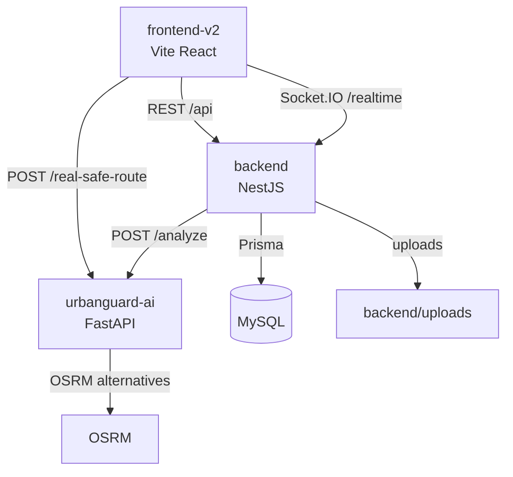

# System Architecture

This file mirrors the current root architecture snapshot for the active apps: `backend/`, `frontend-v2/`, and `urbanguard-ai/`.

## Containers

```mermaid
flowchart TB
  FE["frontend-v2\nVite React"] -->|"REST /api"| API["backend\nNestJS"]
  FE -->|"Socket.IO /realtime"| API
  FE -->|"POST /real-safe-route"| AI["urbanguard-ai\nFastAPI"]
  API -->|"Prisma"| DB[("MySQL")]
  API -->|"POST /analyze"| AI
  API -->|"uploads"| FS["backend/uploads"]
  AI -->|"OSRM alternatives"| OSRM["OSRM"]
```

## Backend Responsibilities

- Auth and current user
- User management and ban/unban
- Report creation, active report feed, voting
- Pending-report queue for admin
- Notifications and Socket.IO gateway
- Statistics and heatmap data
- Static upload serving

## Frontend Responsibilities

- Login/register and current-user context
- Protected app shell
- Map, report markers, danger zones, heatmap
- Safe-route UI
- Report submission
- Notification management
- Admin user and report management screens

## AI Responsibilities

- Analyze incident images through `POST /analyze`
- Build route alternatives and choose safer routes through `POST /real-safe-route`

## Known Contract Gaps

| Gap | Impact |
|---|---|
| Missing backend report-management endpoints | Admin report-management UI cannot finish approve/reject/delete flows |
| Vote response mismatch | Vote popup may not update trust score/user vote correctly |
| Missing `notification:new` emission | Unread badge socket update is incomplete |
| AI hard dependency on report creation | Report submission can fail when AI is unavailable |

For the longer architecture version, see `../../SYSTEM_ARCHITECTURE.md`.

