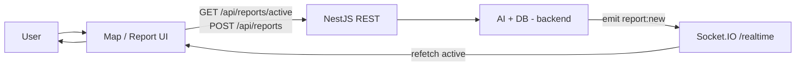

# UrbanGuard — Tài liệu hệ thống Frontend

> **Phiên bản tài liệu:** 1.0 · **Stack:** Next.js (App Router), Tailwind CSS, Leaflet, Socket.IO, OSRM (client)

Tài liệu mô tả kiến trúc, luồng dữ liệu và quy ước triển khai frontend UrbanGuard. Mục tiêu: onboarding nhanh cho dev mới, hỗ trợ debug, và căn chỉnh với backend NestJS.

---

## 1. Tổng quan Frontend

### 1.1 Vai trò trong hệ thống

Frontend UrbanGuard là **ứng dụng web** cho phép:

- **Xem bản đồ** các sự cố giao thông đã được xác thực (`VALIDATED`, `trustScore > 0`).
- **Gửi báo cáo** kèm ảnh; backend xử lý AI và cập nhật trạng thái.
- **Theo dõi realtime** khi có báo cáo mới được duyệt — bản đồ tự làm mới không cần F5.
- **Tìm đường (OSRM)** trên client, với **logic tránh** khi tuyến đi vào vùng đệm quanh sự cố (~115 m).

Frontend **không** thay thế backend về bảo mật hay nghiệp vụ: mọi quy tắc “có được hiển thị hay không” đều được backend thực thi; client lọc thêm một lớp để đồng bộ UX và phòng lệch dữ liệu.

### 1.2 Công nghệ sử dụng

| Lớp | Công nghệ |
|-----|-----------|
| Framework | **Next.js** (App Router), React 19 |
| Styling | **Tailwind CSS** (palette zinc / red / amber) |
| Bản đồ | **Leaflet** + **react-leaflet**, tiles **OpenStreetMap** |
| Gom cụm marker | **react-leaflet-cluster** (MarkerClusterGroup) |
| Routing UI | **leaflet-routing-machine** + OSRM public (`router.project-osrm.org`) |
| Realtime | **socket.io-client** → namespace `/realtime` |
| Animation | **Framer Motion** |
| HTTP | `fetch` (REST), `FormData` (multipart) |

---

## 2. Kiến trúc Frontend

### 2.1 Luồng tổng thể



**Diễn giải ngắn:**

1. Người dùng mở **`/map`** → client gọi **`GET /api/reports/active`** → vẽ marker.
2. Backend khi có báo cáo **VALIDATED** phát **`report:new`** → client **refetch** danh sách active → cập nhật marker.
3. Người dùng chỉnh waypoint OSRM trên map → **Leaflet Routing Machine** gọi OSRM → polyline được so với tọa độ sự cố → banner / chèn waypoint né (xem mục 7).

### 2.2 Tách module (nguyên tắc)

| Vùng | Trách nhiệm |
|------|-------------|
| **`app/`** | Route, layout, composition; ít logic nghiệp vụ. |
| **`components/`** | UI có trạng thái cục bộ (map, form, popup). |
| **`services/`** | Logic domain “dày”: routing, né đường, gọi API có kiểu. |
| **`lib/`** | Helper thuần (cấu hình API, geo/Haversine, theme marker, test). |
| **`hooks/`** | *(Hiện tại chưa có thư mục tùy chỉnh — có thể bổ sung khi tái sử dụng logic lặp.)* |

**Quy tắc:** không hardcode URL backend trong component; luôn qua `getApiBaseUrl()` / `MAP_API_BASE`.

---

## 3. Cấu trúc thư mục (`frontend/src`)

```
src/
├── app/                    # App Router
│   ├── layout.tsx
│   ├── page.tsx            # Trang gốc (marketing mặc định CRA)
│   ├── map/page.tsx        # Trang bản đồ → MapWithNoSSR
│   └── report/             # Gửi báo cáo + auth tối thiểu
├── components/
│   ├── ActiveReportsMap.tsx    # Map + socket + state reports + banner route
│   ├── IncidentRouteControl.tsx # LRM + OSRM + né sự cố
│   ├── MapWithNoSSR.tsx       # dynamic(..., { ssr: false })
│   ├── dev/                   # Công cụ dev (ảnh test)
│   └── map/                   # Marker, popup, vòng danger zone
├── services/
│   ├── report.api.ts          # Login + create report
│   └── routingService.ts      # Zones, banner, detour, INCIDENT_BUFFER_M
├── lib/
│   ├── apiConfig.ts           # NEXT_PUBLIC_API_URL
│   ├── mapActiveReports.ts    # fetchActiveReports, MAP_API_BASE
│   ├── routingAvoidance.ts    # Haversine, khoảng cách điểm–polyline
│   ├── dangerMarkerTheme.ts   # HTML/CSS icon marker
│   ├── dangerZoneRouting.ts   # Re-export (tương thích import cũ)
│   └── *.test.ts
├── types/
│   └── leaflet-routing-machine.d.ts
└── hooks/                     # (optional — chưa dùng trong repo hiện tại)
```

- **`app/`** — Định nghĩa URL và import component; ví dụ `/map` chỉ render `MapWithNoSSR` để tránh SSR Leaflet.
- **`components/`** — Tách `map/` (marker, popup, circle) khỏi shell `ActiveReportsMap`.
- **`services/`** — `routingService` phụ thuộc `lib/routingAvoidance` và type `ActiveReport` từ `mapActiveReports`.
- **`lib/`** — Cấu hình, fetch, toán học địa lý; dễ unit test.
- **`hooks/`** — Dành cho custom hooks (`useActiveReports`, v.v.) khi refactor; hiện state nằm trong `ActiveReportsMap`.

---

## 4. Cấu hình môi trường

### 4.1 File `.env.local` (frontend)

Tạo file **`frontend/.env.local`** (không commit — đã `.gitignore`):

```env
# Gốc backend NestJS — KHÔNG có / ở cuối, KHÔNG thêm /api
NEXT_PUBLIC_API_URL=http://localhost:3000
```

Có thể copy từ `frontend/.env.local.example`.

### 4.2 Nguyên tắc

- **`NEXT_PUBLIC_*`** được Next.js embed vào bundle client; chỉ dùng cho giá trị **không bí mật** (URL API công khai).
- **Không hardcode** `http://localhost:3000` trong component nghiệp vụ; dùng `getApiBaseUrl()` từ `lib/apiConfig.ts`.
- Hàm `getApiBaseUrl()` **chuẩn hoá** (bỏ `/` thừa cuối). Ở **development**, nếu thiếu biến môi trường có thể fallback `http://localhost:3000` kèm `console.warn`; **production** bắt buộc cấu hình rõ ràng.

```ts
// lib/apiConfig.ts — ý tưởng sử dụng
import { getApiBaseUrl } from "@/lib/apiConfig";
const base = getApiBaseUrl();
// fetch(`${base}/api/reports/active`, { cache: "no-store" })
```

---

## 5. API Integration

### 5.1 `lib/mapActiveReports.ts`

- Export **`MAP_API_BASE`**: `getApiBaseUrl()` tại thời điểm module load (dùng chung cho fetch + socket).
- **`fetchActiveReports`**: `GET /api/reports/active`, `cache: "no-store"`, map JSON → `ActiveReport[]`.
- Chuẩn hoá **`aiLabels`**: mảng hoặc chuỗi phân tách `,` / `;`.

```ts
// Ví dụ gọi
const reports = await fetchActiveReports(abortSignal);
```

### 5.2 `services/report.api.ts`

- **`loginRequest`**: `POST /api/auth/login` (JSON).
- **`createReportRequest`**: `POST /api/reports` — **multipart/form-data** (`title`, `description`, `latitude`, `longitude`, `image`), header `Authorization: Bearer <JWT>`.

```http
POST /api/reports
Content-Type: multipart/form-data
Authorization: Bearer <token>

title=...
description=...
latitude=10.76
longitude=106.66
image=<file>
```

### 5.3 Bảng tóm tắt endpoint

| Endpoint | Mục đích | Client |
|----------|----------|--------|
| `GET /api/reports/active` | Danh sách sự cố hiển thị bản đồ | `mapActiveReports.ts` |
| `POST /api/reports` | Tạo báo cáo + AI (backend) | `report.api.ts` |
| `POST /api/auth/login` | JWT cho gửi báo cáo | `report.api.ts` |

---

## 6. Trang Map (`/map`)

### 6.1 Thành phần

- **`app/map/page.tsx`** → **`MapWithNoSSR`** → **`ActiveReportsMap`** (dynamic, không SSR).
- **Leaflet:** `MapContainer`, `TileLayer` (OSM), `FitBounds` theo danh sách báo cáo.
- **Marker:** `DangerMarkersGroup` / `DangerMarker` — icon `divIcon`, có pulse khi gần polyline tuyến đường.
- **Vòng cảnh báo:** `DangerZoneCircle` (bán kính hiển thị ~50 m — khác với buffer 115 m dùng cho routing).

### 6.2 Popup (`ReportDangerPopup`)

Hiển thị (khớp product):

- **Mã báo cáo** `#id`
- **Tiêu đề** (`title`)
- **Trust score**
- **Nhãn AI** (`aiLabels`) nếu có
- **Ảnh** (URL qua `resolveReportImageUrl`)
- **Mô tả**

### 6.3 Logic hiển thị (client)

API `/active` đã lọc phía server; client vẫn lọc lại:

- `status === "VALIDATED"` (so sánh không phân biệt hoa thường khi cần)
- `trustScore > 0`

Chỉ tập này được đưa vào marker + `getValidatedReportsForRouting` (thêm kiểm tra `latitude` / `longitude` hợp lệ).

### 6.4 Realtime

```ts
const socket = io(`${MAP_API_BASE}/realtime`, {
  transports: ["websocket"],
  withCredentials: true,
});

socket.on("report:new", (payload) => {
  console.log("[UrbanGuard realtime] report:new", payload);
  // Refetch khi payload có `report` hoặc `id` (tương thích payload phẳng)
  if (payload phù hợp) void loadReports();
});
```

Sau refetch, `reports` cập nhật → `useMemo`/`FitBounds`/marker re-render theo dữ liệu mới.

---

## 7. Routing & Avoidance

### 7.1 File chính

| File | Vai trò |
|------|---------|
| **`IncidentRouteControl.tsx`** | Gắn LRM, lắng nghe `routesfound`, gọi logic né, cập nhật banner + polyline cha |
| **`routingService.ts`** | `INCIDENT_BUFFER_M = 115`, `dangerZonesFromReports`, `dangerZonesHitByRoute`, `formatIncidentAvoidanceBanner`, chiến lược waypoint |
| **`routingAvoidance.ts`** | Haversine, khoảng cách nhỏ nhất từ **tâm sự cố** tới **polyline** (`minDistancePointToPolylineM`) |
| **`dangerZoneRouting.ts`** | Re-export từ `routingService` (import cũ) |

### 7.2 Logic “va chạm”

1. OSRM trả polyline tuyến đang chọn.
2. Mỗi sự cố → `DangerZone` với **`hitRadiusMeters`** mặc định **115 m** (đồng bộ `INCIDENT_BUFFER_M`).
3. Nếu khoảng cách từ tâm zone đến polyline **≤ hit radius** → coi là **đi vào vùng ảnh hưởng**.
4. Thử **chèn waypoint** lệch vuông góc (nhiều mức mét); hết chiến lược → banner fallback (`ROUTING_FALLBACK_MESSAGE_VI`).

### 7.3 Banner

Hàm `formatIncidentAvoidanceBanner` tạo chuỗi dạng:

```text
Đã phát hiện sự cố [nhãn AI hoặc mô tả] trên lộ trình, đang điều hướng tránh né
```

Hiển thị trong vùng **amber** phía trên map (`routeWarning` trong `ActiveReportsMap`).

### 7.4 An toàn Leaflet / LRM

- Dùng ref cho control routing; **remove control** trong `try/catch` khi unmount hoặc trước khi add lại.
- Gọi tùy chọn `getPlan?.()` trước thao tác waypoint để tránh crash phiên bản LRM khác nhau.

---

## 8. Trang Report (`/report`)

### 8.1 UI

- Đăng nhập (email / mật khẩu) → lưu JWT (`localStorage`).
- **Upload ảnh** (JPEG, PNG, GIF, WebP), preview.
- **Tiêu đề** bắt buộc.
- Vị trí: GPS nếu được phép; không thì tọa độ mặc định (HCM).

### 8.2 Luồng submit

```text
User điền form
  → POST /api/reports (multipart) + Bearer token
  → Backend lưu file, tạo bản ghi, gọi AI
  → Trả về report (PENDING hoặc VALIDATED tùy AI / admin)
  → Toast hiển thị mã báo cáo #id
  → (Tuỳ chọn) redirect /map sau vài giây
```

**Lưu ý UX:** chỉ báo cáo **VALIDATED** + **trust > 0** mới xuất hiện trên `/map`; PENDING cần chờ duyệt hoặc ngưỡng AI.

---

## 9. Realtime (Socket.IO)

| Thuộc tính | Giá trị |
|------------|---------|
| URL | `${MAP_API_BASE}/realtime` |
| Transport | WebSocket (ưu tiên) |
| Credentials | `withCredentials: true` (khớp CORS backend) |
| Event | `report:new` |

**Luồng:** Backend emit khi báo cáo chuyển **VALIDATED** → client log + điều kiện refetch → `loadReports()` → state `reports` mới → UI map cập nhật.

---

## 10. UI / UX Design

### 10.1 Tailwind — ngữ nghĩa màu

- **Red** — nút báo cáo, nhấn mạnh nguy hiểm, trust score trong popup.
- **Amber** — cảnh báo tuyến đường / AI / trạng thái “đang xử lý”.
- **Zinc** — nền, viền, chữ phụ; tương phản rõ với red/amber.

### 10.2 Chuyển động

- **Framer Motion:** header nút quay lại, FAB “+” trên map, sheet form report.
- **Marker:** class pulse khi marker gần polyline (trong `dangerMarkerTheme` + `DangerMarker`).
- **Route:** do OSRM/LRM vẽ lại khi waypoint đổi — giữ `routeWhileDragging` tắt để giảm request.

---

## 11. State Management

- **Chưa dùng** Redux/Zustand; đủ với **React `useState` / `useEffect` / `useMemo` / `useCallback`**.
- **`reports`:** cache danh sách active trong `ActiveReportsMap`; nguồn sự thật vẫn là API.
- **Realtime:** refetch toàn bộ `/active` khi `report:new` (đơn giản, nhất quán với backend).
- **Routing:** refs cho chỉ số chèn waypoint, cờ fallback, control LRM — tránh stale closure trong handler `routesfound`.

---

## 12. Performance

| Chiến lược | Chi tiết |
|------------|----------|
| Memo hóa | `useMemo` cho `validatedReports`, `reportsForRouting`; `useCallback` cho `loadReports`, handlers |
| Marker | `key={r.id}` ổn định; cluster khi > 12 điểm (mặc định) |
| ROI | `getNearbyDangers` chỉ xét zone trong ~1400 m quanh polyline |
| Map SSR | `dynamic(..., { ssr: false })` — không hydrate Leaflet trên server |
| Debounce routing | OSRM được gọi bởi LRM; tránh bật `routeWhileDragging` để giảm tải |

**Hướng cải tiến:** debounce thủ công nếu thêm tìm kiếm địa điểm hoặc kéo waypoint tùy chỉnh dày đặc.

---

## 13. Flow hoạt động (end-to-end)

```text
User mở /map
  → fetch GET /api/reports/active
  → hiển thị marker + vòng danger + (tuỳ chọn) cluster

Socket kết nối /realtime
  → nhận report:new
  → refetch active
  → cập nhật marker / fit bounds

User chỉnh waypoint trên LRM
  → OSRM trả route
  → so với sự cố (buffer 115 m)
  → banner + thử chèn waypoint né hoặc thông báo fallback

User mở /report → đăng nhập → gửi ảnh + tiêu đề
  → POST /api/reports
  → backend + AI
  → phản hồi #id + trạng thái
```

---

## 14. Checklist kiểm thử (QA)

- [ ] **Map load:** tiles OSM hiển thị, không lỗi console nghiêm trọng.
- [ ] **Marker:** đúng vị trí, popup đủ title / trust / aiLabels / ảnh.
- [ ] **Điều kiện hiển thị:** chỉ VALIDATED + trust > 0 (đối chiếu Swagger + DB).
- [ ] **Realtime:** sau khi backend validate báo cáo mới, map cập nhật không F5 (xem log `report:new`).
- [ ] **Routing:** tuyến cắt vùng ~115 m → banner amber; có thử né hoặc fallback message.
- [ ] **Ổn định Leaflet:** chuyển trang / đóng component không throw `removeControl`.
- [ ] **Report:** multipart thành công, JWT hết hạn có thông báo rõ.
- [ ] **CORS + env:** `NEXT_PUBLIC_API_URL` đúng cổng backend; `credentials` khớp.

---

## Phụ lục — Liên kết nhanh

| Tài nguyên | Đường dẫn trong repo |
|------------|----------------------|
| Map chính | `frontend/src/components/ActiveReportsMap.tsx` |
| Routing / né | `frontend/src/components/IncidentRouteControl.tsx` |
| API map | `frontend/src/lib/mapActiveReports.ts` |
| API báo cáo | `frontend/src/services/report.api.ts` |
| Cấu hình URL | `frontend/src/lib/apiConfig.ts` |
| Docs map chi tiết (legacy) | `docs/03-frontend/map-integration.md` |

---

*Tài liệu này phản ánh codebase tại thời điểm biên soạn; khi đổi contract API hoặc event socket, cập nhật song song backend và mục 5–9.*
